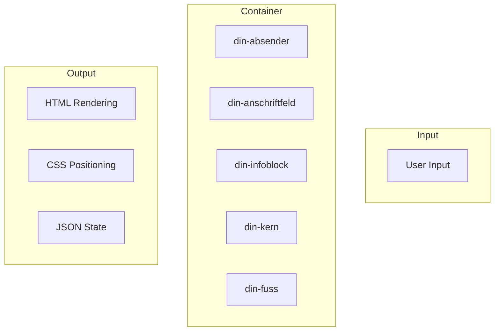

---
# === BASISINFORMATIONEN ===
title: "IMR 4.0 — Die Definitive DIN 5008 Registry (Platinum Master)"
subtitle: "Complete HTML Tag Registry for DIN-BriefNEO"
description: "Alle 45+ atomaren Daten-Tags mit Positionierung, Ausrichtung und Wachstumsverhalten nach DIN 5008"
version: "4.7.0"
version_date: 2026-03-31
status: active
type: "registry"

# === DOKUMENT-TYP ===
category: reference
audience:
  - developers
  - implementers
  - testers
  - ai-agents

# === TAGS ===
tags:
  - din-briefneo
  - din-briefneo/imr
  - din-briefneo/html
  - din-briefneo/registry
  - status/active
  - type/registry
  - tech/html
  - tech/custom-elements
  - standard/din-5008

# === ALIASES ===
aliases:
  - "02_IMR_Registry"
  - "IMR Registry"
  - "DIN 5008 Tags"
  - "HTML Tag List"
  - "Custom Elements Registry"
  - "Atomic Tags"
  - "45 DIN Fields"

# === DATAVIEW Felder ===
total_tags: 45
single_line_tags: 40
multi_line_tags: 5
validation_enabled: true
din_compliance: "100% DIN 5008:2020-03"
tag_categories:
  - "Absender-Zone"
  - "Anschriftfeld"
  - "Metadaten & Infoblock"
  - "Briefkern"
  - "Fußzeile"
  - "Systemkomponenten"

# === VERWANDTE DOKUMENTE ===
related:
  - "01_Architecture_Compliance"
  - "03_CSS_Reference"
  - "05_Feature_Matrix"
  - "06_Salutation_Engine"

# === ZEITSTEMPEL ===
date_created: 2026-03-31
date_updated: 2026-03-31
date_validated: 2026-03-31

# === AUTOR ===
author: "@grapefruit89"
maintainer: "@grapefruit89"

# === OBSIDIAN ===
cssclasses:
  - wide-table
  - table-stripes
  - no-wrap

# === GITHUB PAGES ===
permalink: /docs/imr-registry/
layout: default
---

# IMR 4.0 — Die Definitive DIN 5008 Registry (Platinum Master)

> [!NOTE]
> Das Anschriftfeld hat eine feste Höhe von 45mm[^1]. Überlaufender Text wird durch den Overflow-Alarm (`@container scroll-state`) visuell markiert.

> **Single Source of Truth (SSoT)** für die Platinum Validation Pipeline (PVP).  
> Diese Liste definiert alle **45 atomaren Daten-Tags** (inkl. Guides) mit Positionierung, Ausrichtung und Wachstumsverhalten.

---

## 📊 **Übersicht**

<details>
<summary>📋 Bereichs-Übersicht & Container-Struktur</summary>

| Bereich | Tags | Container | Wuchs-Verhalten |
|---------|------|-----------|-----------------|
| **Absender-Zone** | 8 | `<din-absender>` | Top-Down |
| **Anschriftfeld** | 8 | `<din-anschriftfeld>` | Top-Down (Fix 45mm) |
| **Metadaten & Infoblock** | 8 | `<din-infoblock>` | Top-Down |
| **Briefkern** | 6 | `<din-kern>` | Dynamisch |
| **Fußzeile** | 12 | `<din-fuss>` | Spalten-basiert |
| **Systemkomponenten** | 3 | – | – |

</details>

---

## 🗺️ **Architektur-Übersicht**



---

## 🏢 1. Absender-Zone (Branding)

**Container:** `<din-absender>`  
**Position:** X: `25mm` | Y: `var(--din-y-header-start)`  
**Standard:** Form A: `27mm` | Form B: `45mm`

| Tag | Beschreibung | Ausrichtung | Validierung | DIN / Context7 |
|:---|:---|:---:|:---|:---|
| `<din-branding-logo>` | Firmenlogo (SVG/Base64) | Rechts | — | [`/whatwg/html`](https://html.spec.whatwg.org/) |
| `<din-absender-vorname>` | Vorname Absender | Links | `plaintext` | DIN 5008: 16.1 |
| `<din-absender-nachname>` | Nachname Absender | Links | `plaintext` | DIN 5008: 16.1 |
| `<din-absender-strasse>` | Straße & Hausnr. | Links | `plaintext` | DIN 5008: 16.1 |
| `<din-absender-ort>` | PLZ & Ort | Links | `plaintext` | DIN 5008: 16.1 |
| `<din-absender-zusatz>` | Adresszusatz | Links | `plaintext` | DIN 5008: 16.1 |
| `<din-absender-mail>` | E-Mail Adresse | Links | `type="email"` | `mailto:` |
| `<din-absender-tel>` | Telefonnummer | Links | `type="tel"` | `tel:` |

---

## ✉️ 2. Anschriftfeld (Empfänger)

**Container:** `<din-anschriftfeld>`  
**Position:** X: `25mm` | Y: `var(--din-y-header-start) + 17.7mm`  
**Max-Breite:** `85mm` | **Höhe:** `45mm` (Fix)

| Tag | Beschreibung | Zeile | Ausrichtung | Validierung | DIN / Context7 |
|:---|:---|:---:|:---:|:---|:---|
| `<din-rucksendezeile>` | Kleinstzeile | 1 (fix) | Links | `font-size: 8pt` | DIN 5008: 16.1.2 |
| `<din-zusaetze>` | Vermerke/Zusätze | 2-4 | Links | — | DIN 5008: 16.1.3 |
| `<din-empfaenger-firma>` | Firmenname | 5-9 | Links | `plaintext` | DIN 5008: 16.1.4 |
| `<din-empfaenger-abteilung>` | Abteilung | 5-9 | Links | `plaintext` | DIN 5008: 16.1.4 |
| `<din-empfaenger-vorname>` | Vorname | 5-9 | Links | `plaintext` | DIN 5008: 16.1.4 |
| `<din-empfaenger-nachname>` | Nachname | 5-9 | Links | `plaintext` | DIN 5008: 16.1.4 |
| `<din-empfaenger-strasse>` | Straße & Hausnr. | 5-9 | Links | `plaintext` | DIN 5008: 16.1.4 |
| `<din-empfaenger-ort>` | PLZ & Ort | 5-9 | Links | `plaintext` | DIN 5008: 16.1.4 |

> ⚠️ **Wichtig:** Das Anschriftfeld hat eine **feste Höhe von 45mm**. Überlaufender Text wird abgeschnitten (DIN 5008 Konformität).

---

## 📅 3. Metadaten & Infoblock

**Container:** `<din-infoblock>`  
**Position:** X: `125mm` | Y (A): `79.4mm` | Y (B): `97.4mm`  
**Wuchs:** Top-Down

| Tag | Beschreibung | Y (A) | Y (B) | Ausrichtung | Validierung | DIN / Context7 |
|:---|:---|:---:|:---:|:---:|:---|:---|
| `<din-datum>` | Briefdatum | 27 | 45 | Links | `Temporal.PlainDate` | DIN 5008: 17.2 |
| `<din-ihr-zeichen>` | Ihr Zeichen | 79.4 | 97.4 | Links | — | DIN 5008: 17.1 |
| `<din-ihr-schreiben>` | Ihr Schreiben vom | 84.4 | 102.4 | Links | `ISO-8601` | [`/tc39/proposal-temporal`](https://tc39.es/proposal-temporal/) |
| `<din-unser-zeichen>` | Unser Zeichen | 89.4 | 107.4 | Links | — | DIN 5008: 17.1 |
| `<din-unser-schreiben>` | Bezugsdatum | 94.4 | 112.4 | Links | `ISO-8601` | [`/tc39/ecma262`](https://tc39.es/ecma262/) |
| `<din-durchwahl>` | Direkte Telefonnr. | 99.4 | 117.4 | Links | `type="tel"` | `tel:` |
| `<din-email-direkt>` | Direkte E-Mail | 104.4 | 122.4 | Links | `type="email"` | `mailto:` |
| `<din-internet>` | Web-URL | 109.4 | 127.4 | Links | `type="url"` | [`/whatwg/html`](https://html.spec.whwg.org/) |

---

## 📝 4. Briefkern (Dynamischer Inhalt)

**Container:** `<din-kern>`  
**Position:** X: `25mm` | Y (A): `85.4mm` | Y (B): `103.4mm`  
**Max-Breite:** `165mm` | **Wuchs:** Top-Down (dynamisch, triggert Paginierung)

| Tag | Beschreibung | Y (A) | Y (B) | Ausrichtung | Zeilen | Validierung | DIN / Context7 |
|:---|:---|:---:|:---:|:---:|:---:|:---|:---|
| `<din-betreff>` | Betreff (fett) | 85.4 | 103.4 | Links | **Einzeilig** | Max 2 Zeilen | DIN 5008: 18 |
| `<din-anrede>` | Anredeformel | 100.4 | 118.4 | Links | **Einzeilig** | — | DIN 5008: 19 |
| `<din-text>` | Haupt-Inhalt | 110.4 | 128.4 | Blocksatz* | **Mehrzeilig** | Sanitizer API | DIN 5008: 20 |
| `<din-grussformel>` | Grußformel | Ende | Ende | Links | **Einzeilig** | — | DIN 5008: 21 |
| `<din-unterschrift>` | Unterzeichner | Ende | Ende | Links | **Einzeilig** | — | DIN 5008: 22 |
| `<din-anlagen>` | Anlagenverzeichnis | Ende | Ende | Links | **Mehrzeilig** | — | DIN 5008: 23 |

> ℹ️ **Blocksatz mit Silbentrennung** wird für DIN-Briefe empfohlen:  
> `text-align: justify; text-justify: inter-word; hyphens: auto;`


---

## 📄 5. Fußzeile (Footer) – 4 Spalten

**Container:** `<din-fuss>`  
**Position:** X: `25mm` | Y: `241mm`  
**Max-Breite:** `165mm` | **Wuchs:** Spalten-basiert  
**Layout:** 4 Spalten (je 25% Breite)

| Tag | Beschreibung | Spalte | Y | Ausrichtung | Zeilen | Validierung | DIN / Context7 |
|:---|:---|:---:|:---:|:---:|:---:|:---|:---|
| `<din-fuss-firma>` | Firmenbezeichnung | 1 | 241 | Links | **Einzeilig** | — | DIN 5008: 24 |
| `<din-fuss-sitz>` | Firmensitz | 1 | 246 | Links | **Einzeilig** | — | DIN 5008: 24 |
| `<din-fuss-gericht>` | Registergericht | 1 | 251 | Links | **Einzeilig** | — | DIN 5008: 24 |
| `<din-fuss-hrb>` | Handelsregister-Nr. | 1 | 256 | Links | **Einzeilig** | — | DIN 5008: 24 |
| `<din-fuss-vorstand>` | Vorstand / Inhaber | 2 | 241 | Links | **Mehrzeilig** | — | DIN 5008: 24 |
| `<din-fuss-gf>` | Geschäftsführer | 2 | 251 | Links | **Mehrzeilig** | — | DIN 5008: 24 |
| `<din-fuss-stnr>` | Steuernummer | 3 | 241 | Links | **Einzeilig** | — | DIN 5008: 24 |
| `<din-fuss-ustid>` | USt-IdNr. | 3 | 246 | Links | **Einzeilig** | — | DIN 5008: 24 |
| `<din-fuss-bank>` | Name der Bank | 4 | 241 | Links | **Einzeilig** | — | DIN 5008: 24 |
| `<din-fuss-iban>` | IBAN | 4 | 246 | Links | **Einzeilig** | `BigInt` Mod-97 | ISO 13616 |
| `<din-fuss-bic>` | BIC | 4 | 251 | Links | **Einzeilig** | `regex` | ISO 9362 |
| `<din-fuss-anschrift>` | Hausanschrift | 4 | 256 | Links | **Einzeilig** | — | DIN 5008: 24 |

---

## 🛠️ 6. Systemkomponenten (Guides)

Diese Tags dienen der internen Visualisierung und Compliance-Kontrolle.

`<din-falz-oben>`
:   Obere Faltmarke. Positioniert sich fix bei `var(--din-y-header-start) + 60mm`.

`<din-falz-unten>`
:   Untere Faltmarke. Positioniert sich fix bei `var(--din-y-header-start) + 165mm`.

`<din-overlay>`
:   SVG-Referenz-Overlay für den visuellen Layout-Audit (Platinum Feature).

---

[^1]: DIN 5008:2020-03, Abschnitt 16.1.4 – Maße des Anschriftfeldes für Fensterbriefe.

## 🔗 Dokumenten-Navigation

| Dokument | Zweck |
|----------|-------|
| [[01_Architecture_Compliance]] | Technologie-Leitplanken |
| [[02_IMR_Registry]] | Alle 42+ DIN-Tags |
| [[03_CSS_Reference]] | CSS-Features Referenz |
| [[05_Feature_Matrix]] | Projekt-Fortschritt |
| [[06_Salutation_Engine]] | Logik-Dokumentation |

**Gesamtversion:** 4.7 | **Letzte Sync:** 2026-03-31

---

## 🔗 Verwandte Dokumente (Dataview)

```dataview
TABLE 
  version AS "Version",
  status AS "Status",
  date_updated AS "Aktualisiert"
FROM ""
WHERE contains(related, this.file.name)
SORT version DESC
```

---

**Status:** ACTIVE  
**Nächste Überprüfung:** 2026-04-30  
**Verantwortlich:** Lead Systems Architect
