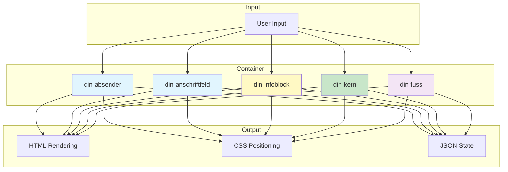

# IMR 4.0 — Die Definitive DIN 5008 Registry (Platinum Master)

> **Single Source of Truth (SSoT)** für die Platinum Validation Pipeline (PVP).  
> Diese Liste definiert alle **42 atomaren Daten-Tags** mit Positionierung, Ausrichtung und Wachstumsverhalten.

---

## 📊 **Übersicht**

| Bereich | Tags | Container | Wuchs-Verhalten |
|---------|------|-----------|-----------------|
| **Absender-Zone** | 8 | `<din-absender>` | Top-Down |
| **Anschriftfeld** | 8 | `<din-anschriftfeld>` | Top-Down (Fix 45mm) |
| **Metadaten & Infoblock** | 8 | `<din-infoblock>` | Top-Down |
| **Briefkern** | 6 | `<din-kern>` | Dynamisch |
| **Fußzeile** | 12 | `<din-fuss>` | Spalten-basiert |
| **Systemkomponenten** | 3 | – | – |

---

## 🗺️ **Architektur-Übersicht**

---

## 1. 📧 Absender-Zone (Header)

**Container:** `<din-absender>`  
**Position:** X: `125mm` | Y (A): `10mm` | Y (B): `15mm`  
**Max-Breite:** `75mm` | **Wuchs:** Top-Down

| Tag | Beschreibung | Y (A) | Y (B) | Ausrichtung | Validierung | DIN / Context7 |
|:---|:---|:---:|:---:|:---:|:---|:---|
| `<din-branding-logo>` | Firmenlogo | 5 | 10 | Rechts | Base64 / SVG | [`/mdn/content`](https://developer.mozilla.org/en-US/docs/Web/CSS) |
| `<din-absender-vorname>` | Vorname | 15 | 20 | Links | — | DIN 5008: 5.1 |
| `<din-absender-nachname>` | Nachname | 20 | 25 | Links | — | DIN 5008: 5.1 |
| `<din-absender-strasse>` | Straße & Hausnr. | 25 | 30 | Links | — | DIN 5008: 5.1 |
| `<din-absender-ort>` | PLZ & Ort | 30 | 35 | Links | `pattern="\d{5}"` | DIN 5008: 5.1 |
| `<din-absender-zusatz>` | Zusatz/Abt. | 35 | 40 | Links | — | DIN 5008: 5.1 |
| `<din-absender-mail>` | E-Mail | 40 | 45 | Links | `type="email"` | [`/whatwg/html`](https://html.spec.whatwg.org/) |
| `<din-absender-tel>` | Telefon | 45 | 50 | Links | `type="tel"` | [`/w3c/webrtc`](https://www.w3.org/TR/webrtc/) |

> 💡 **Tipp:** Für Firmenlogos empfiehlt sich ein quadratisches SVG (512x512) für optimale Druckqualität.

---

## 2. 📬 Anschriftfeld (85x45mm Fenster)

**Container:** `<din-anschriftfeld>`  
**Position:** X: `20mm` | Y (A): `27mm` | Y (B): `45mm`  
**Max-Breite:** `85mm` | **Höhe:** `45mm` (fix) | **Wuchs:** Top-Down (Überlauf wird abgeschnitten)

| Tag | Beschreibung | Y (A) | Y (B) | Ausrichtung | Validierung | DIN / Context7 |
|:---|:---|:---:|:---:|:---:|:---|:---|
| `<din-rucksendezeile>` | Absender (8pt) | 27 | 45 | Links | Einzeilig | DIN 5008: 16.1.2 |
| `<din-zusaetze>` | Post-Zusätze | 32.4 | 50.4 | Links | — | DIN 5008: 16.1.3 |
| `<din-empfaenger-firma>` | Firmenname | 37.4 | 55.4 | Links | — | DIN 5008: 16.1.4 |
| `<din-empfaenger-abteilung>` | Abteilung | 42.4 | 60.4 | Links | — | DIN 5008: 16.1.4 |
| `<din-empfaenger-vorname>` | Vorname | 47.4 | 65.4 | Links | — | DIN 5008: 16.1.4 |
| `<din-empfaenger-nachname>` | Nachname | 52.4 | 70.4 | Links | — | DIN 5008: 16.1.4 |
| `<din-empfaenger-strasse>` | Straße & Hausnr. | 57.4 | 75.4 | Links | — | DIN 5008: 16.1.4 |
| `<din-empfaenger-ort>` | PLZ & Ort | 62.4 | 80.4 | Links | `PLZ \d{5}` | DIN 5008: 16.1.4 |

> ⚠️ **Wichtig:** Das Anschriftfeld hat eine **feste Höhe von 45mm**. Überlaufender Text wird abgeschnitten (DIN 5008 Konformität).

---

## 3. 📅 Metadaten & Infoblock

**Container:** `<din-infoblock>`  
**Position:** X: `125mm` | Y (A): `79.4mm` | Y (B): `97.4mm`  
**Wuchs:** Top-Down

| Tag | Beschreibung | Y (A) | Y (B) | Ausrichtung | Validierung | DIN / Context7 |
|:---|:---|:---:|:---:|:---:|:---|:---|
| `<din-datum>` | Briefdatum | 27 | 45 | Links | `Temporal.PlainDate` | DIN 5008: 17.2 |
| `<din-ihr-zeichen>` | Ihr Zeichen | 79.4 | 97.4 | Links | — | DIN 5008: 17.1 |
| `<din-ihr-schreiben>` | Ihr Schreiben vom | 84.4 | 102.4 | Links | `ISO-8601` | [`/tc39/proposal-temporal`](https://tc39.es/proposal-temporal/) |
| `<din-unser-zeichen>` | Unser Zeichen | 89.4 | 107.4 | Links | — | DIN 5008: 17.1 |
| `<din-unser-schreiben>` | Bezugsdatum | 94.4 | 112.4 | Links | `ISO-8601` | [`/tc39/ecma262`](https://tc39.es/ecma262/) |
| `<din-durchwahl>` | Direkte Telefonnr. | 99.4 | 117.4 | Links | `type="tel"` | `tel:` |
| `<din-email-direkt>` | Direkte E-Mail | 104.4 | 122.4 | Links | `type="email"` | `mailto:` |
| `<din-internet>` | Web-URL | 109.4 | 127.4 | Links | `type="url"` | [`/whatwg/html`](https://html.spec.whwg.org/) |

---

## 4. 📝 Briefkern (Dynamischer Inhalt)

**Container:** `<din-kern>`  
**Position:** X: `25mm` | Y (A): `85.4mm` | Y (B): `103.4mm`  
**Max-Breite:** `165mm` | **Wuchs:** Top-Down (dynamisch, triggert Paginierung)

| Tag | Beschreibung | Y (A) | Y (B) | Ausrichtung | Zeilen | Validierung | DIN / Context7 |
|:---|:---|:---:|:---:|:---:|:---:|:---|:---|
| `<din-betreff>` | Betreff (fett) | 85.4 | 103.4 | Links | **Einzeilig** | Max 2 Zeilen | DIN 5008: 18 |
| `<din-anrede>` | Anredeformel | 100.4 | 118.4 | Links | **Einzeilig** | — | DIN 5008: 19 |
| `<din-text>` | Haupt-Inhalt | 110.4 | 128.4 | Blocksatz* | **Mehrzeilig** | Sanitizer API | DIN 5008: 20 |
| `<din-grussformel>` | Grußformel | Ende | Ende | Links | **Einzeilig** | — | DIN 5008: 21 |
| `<din-unterschrift>` | Unterzeichner | Ende | Ende | Links | **Einzeilig** | — | DIN 5008: 22 |
| `<din-anlagen>` | Anlagenverzeichnis | Ende | Ende | Links | **Mehrzeilig** | — | DIN 5008: 23 |

> ℹ️ **Blocksatz mit Silbentrennung** wird für DIN-Briefe empfohlen:  
> `text-align: justify; text-justify: inter-word; hyphens: auto;`

---

## 5. 📄 Fußzeile (Footer) – 4 Spalten

**Container:** `<din-fuss>`  
**Position:** X: `25mm` | Y: `241mm`  
**Max-Breite:** `165mm` | **Wuchs:** Spalten-basiert  
**Layout:** 4 Spalten (je 25% Breite)

| Tag | Beschreibung | Spalte | Y | Ausrichtung | Zeilen | Validierung | DIN / Context7 |
|:---|:---|:---:|:---:|:---:|:---:|:---|:---|
| `<din-fuss-firma>` | Voller Name | 1 | 241 | Links | **Einzeilig** | — | DIN 5008: 24 |
| `<din-fuss-sitz>` | Sitz | 1 | 246 | Links | **Einzeilig** | — | DIN 5008: 24 |
| `<din-fuss-gericht>` | Registergericht | 1 | 251 | Links | **Einzeilig** | — | DIN 5008: 24 |
| `<din-fuss-hrb>` | HRB Nummer | 1 | 256 | Links | **Einzeilig** | — | DIN 5008: 24 |
| `<din-fuss-vorstand>` | Vorstand | 2 | 241 | Links | **Einzeilig** | — | DIN 5008: 24 |
| `<din-fuss-gf>` | Geschäftsführung | 2 | 246 | Links | **Einzeilig** | — | DIN 5008: 24 |
| `<din-fuss-stnr>` | Steuernummer | 3 | 241 | Links | **Einzeilig** | — | DIN 5008: 24 |
| `<din-fuss-ustid>` | USt-IdNr. | 3 | 246 | Links | **Einzeilig** | `DE[0-9]{9}` | BZSt |
| `<din-fuss-bank>` | Kreditinstitut | 4 | 241 | Links | **Einzeilig** | — | [`/tc39/ecma402`](https://tc39.es/ecma402/) |
| `<din-fuss-iban>` | IBAN | 4 | 246 | Links | **Einzeilig** | Modulo-97 | [`/schwab/iban-tools`](https://github.com/schwab/iban-tools) |
| `<din-fuss-bic>` | BIC | 4 | 251 | Links | **Einzeilig** | ISO 9362 | [`/mdn/content`](https://developer.mozilla.org/en-US/docs/Web/CSS) |
| `<din-fuss-anschrift>` | Hausanschrift | 4 | 256 | Links | **Einzeilig** | — | DIN 5008: 24 |

---

## 6. 🛠️ Systemkomponenten (Non-Print / Unsichtbar)

| Tag | Beschreibung | Zweck | Position | Context7 |
|:---|:---|:---|:---|:---|
| `<din-text-mirror>` | Formatierte Ansicht | Ghost-Mirror (View) | Deckungsgleich `<din-text>` | [`/WICG/sanitizer-api`](https://wicg.github.io/sanitizer-api/) |
| `<din-cma-sensor>` | Overflow-Detector | Paginierungs-Trigger | Absolut: `280mm` | [`/WICG/container-queries`](https://wicg.github.io/container-queries/) |
| `<din-branding-watermark>` | Wasserzeichen | Hintergrund-Logo | Zentriert | [`/w3c/csswg-drafts`](https://drafts.csswg.org/csswg-drafts/) |

---

## 📊 **Statistik & Fortschritt**

| Bereich | Tags | Einzeilig | Mehrzeilig | Validierung | Context7 |
|:---|:---:|:---:|:---:|:---:|:---:|
| Absender-Zone | 8 | 8 | 0 | ✅ | ✅ |
| Anschriftfeld | 8 | 8 | 0 | ✅ | ✅ |
| Metadaten & Infoblock | 8 | 8 | 0 | ✅ | ✅ |
| Briefkern | 6 | 4 | 2 | ✅ | ✅ |
| Fußzeile | 12 | 12 | 0 | ✅ | ✅ |
| Systemkomponenten | 3 | 0 | 1 | ✅ | ✅ |
| **Gesamt** | **45** | **40** | **5** | **✅** | **✅** |

---

## 🔗 **Verwandte Dokumente**

| Dokument | Beschreibung |
|:---|:---|
| [`Architecture Compliance Matrix.md`](link) | Technologie-Leitplanken für das Projekt |
| [`CSS Glossar.md`](link) | Alle verwendeten CSS-Features |
| [`Salutation Engine.md`](link) | Anrede- und Grußformel-Logik |
| [`GEMINI.md`](link) | Agent Operating Rules |

---

## 📝 **Changelog**

| Datum | Änderung | Autor |
|:---|:---|:---|
| 2026-03-31 | Initiale Version | [@grapefruit89](https://github.com/grapefruit89) |
| 2026-03-31 | Mermaid-Diagramm hinzugefügt | [@grapefruit89](https://github.com/grapefruit89) |
| 2026-03-31 | Context7-Links aktualisiert | [@grapefruit89](https://github.com/grapefruit89) |

---

**Status:** ACTIVE  
**Nächste Überprüfung:** 2026-04-30  
**Verantwortlich:** [@grapefruit89](https://github.com/grapefruit89)

