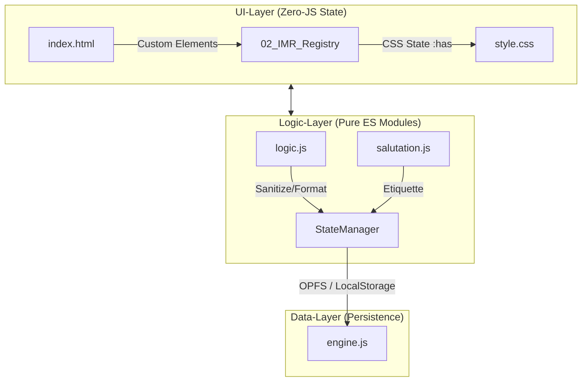

# 📄 DIN-BriefNEO Platinum (v4.8)

Zentrale Einstiegsseite für die technische Dokumentation und Architektur von DIN-BriefNEO.

---

## 🏗️ Architektur-Überblick

Dieses Diagramm visualisiert das Zusammenspiel der atomaren Komponenten gemäß **ADR-017 (Flat & Pure)**.



---

## 🗺️ Dokumenten-Landkarte

| Dok # | Dokument | Fokus | Zielgruppe |
|-------|----------|-------|------------|
| 01 | [[01_Architecture_Compliance]] | APIs, Chrome-Versionen, Leitplanken | Architekten |
| 02 | [[issues/#1_IMR_Registry]] | Alle 45+ HTML-Tags & Positionen (SSoT) | Entwickler |
| 03 | [[03_CSS_Reference]] | Detaillierte CSS-Features & Beispiele | Entwickler |
| 04 | [[04_CSS_Quick_Reference]] | Executive Summary der Tech-Highlights | Management |
| 05 | [[05_Feature_Matrix]] | Roadmap, Sprint-Status & Issues | Alle |
| 06 | [[06_Salutation_Engine]] | Logik-Code & Business-Regeln | Entwickler |

---

## 🚀 Platinum Baseline
- **Plattform:** Chrome 147+ (Native APIs only)
- **Architektur:** Flat & Pure (Keine Frameworks, kein UI-State in JS)
- **Compliance:** 100% DIN 5008:2020-03

---

## 🔗 Alle Dokumente (Dataview Query)

```dataview
TABLE subtitle AS "Untertitel", version AS "Version", status AS "Status"
FROM "0"
SORT file.name ASC
```

---

**Gesamtversion:** 4.8 | **Status:** ✅ Stabil | **Letzte Sync:** 2026-04-01
