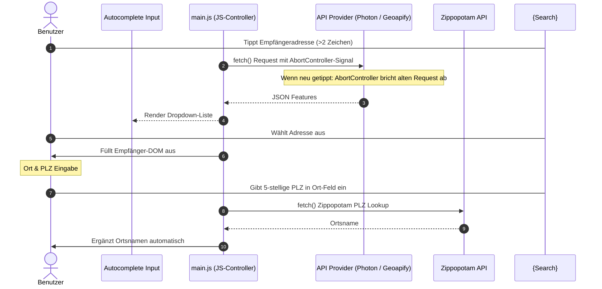

# Architectural Decision Record (ADR): External API Integrations & Header Security

## Status
Akzeptiert

## Kontext & Problemstellung
Eine effiziente, datenschutzkonforme und reibungsfreie Adress-Vervollständigung ist ein zentrales Komfortmerkmal. Viele gebräuchliche Autocomplete-Lösungen (wie die Google Places API) erfordern jedoch die Angabe von Kreditkarten bei der Registrierung und beeinträchtigen durch schwere SDKs die Performance und Offline-Fähigkeit. Das **DIN-BriefNEO**-Projekt benötigt ein schnelles, kostenloses und datenschutzkonformes API-Konzept, das vollständig unter lokalen Kontexten (`file:///`) operiert.

---

## Entscheidungen

### 1. Dual-Provider Autocomplete (Photon & Geoapify)
Wir implementieren einen asynchronen Adressdienst in der Sidebar, der zwei separate Provider anbindet:
*   **Photon (Komoot/OSM):** 100% kostenlos und **ohne API-Key** nutzbar. Die Abfragen werden standardmäßig auf eine Deutschland-Boundingbox (`bbox=5.0,45.0,16.0,56.0`) eingegrenzt, um präzise, inländische Vorschläge zu liefern.
*   **Geoapify (Premium):** Erfordert einen API-Key. Das Eingabefeld wird dynamisch ein- und ausgeblendet.

### 2. Header-Security für API-Keys
Bei der Anbindung von Geoapify wird der API-Key **ausschließlich** über den sicheren HTTP-Header `X-Api-Key` an den Web-Service übermittelt – niemals als URL-Parameter!
*   **Begründung:** Verhindert das Exponieren oder Leaken des Schlüssels in Netzwerk-Caches, Web-Proxys, DNS-Logs oder Browser-Verlaufseinträgen.

### 3. Key Heartbeat-Validierung
Bei Eingabe eines Geoapify API-Keys wird dieser mit 500ms Debounce asynchron per Heartbeat-Anfrage (`text=Bonn&limit=1`) validiert.
*   **Ablauf:** Liefert die API ein erfolgreiches `ok` (Status 200), wird der Key dauerhaft gespeichert und das Suchfeld freigeschaltet. Andernfalls wird der Key verworfen und ein Fehler-Toast ausgegeben.

### 4. Race-Condition-Schutz via AbortController
Um unvollständige oder veraltete Netzwerkeingänge bei schnellem Tippen abzusichern, bricht JS laufende Fetch-Anfragen über die native `AbortController`-API (`signal`) sofort ab, sobald eine neue Tastatureingabe erfolgt.

### 5. Zippopotam PLZ Auto-Lookup
Wir integrieren einen Listener auf das Feld *PLZ & Ort* (`#empfaenger-ort`). Gibt der Benutzer eine 5-stellige deutsche Postleitzahl ein, fragt das System im Hintergrund die kostenlose **Zippopotam API** (`https://api.zippopotam.us/de/${zip}`) ab und ergänzt den Ortsnamen automatisch (z. B. *"93049 Regensburg"*).

---

## Konsequenzen
*   **Vorteile:**
    *   Hundertprozentig datenschutzkonform und DSGVO-freundlich.
    *   Keinerlei Kosten oder Kreditkartenzwang für den Anwender.
    *   Vollständige `file:///`-Kompatibilität ohne CORS-Probleme.
    *   Zuverlässiger Schutz vor veralteten Netzwerkeingängen dank Aborting.
*   **Nachteile:**
    *   Die Autovervollständigung setzt eine aktive Internetverbindung voraus (manuelle Eingaben auf dem Briefpapier sind jedoch jederzeit offline möglich).

---

## Verknüpfungen
*   Siehe [ADR-HTML.md](ADR-HTML.md) für die Einbettung des Widgets.
*   Siehe [ADR-JS.md](ADR-JS.md) für Drosselung und Datenbindung.
*   Siehe [ADR-FEATURE.md](ADR-FEATURE.md) für das Proximity-Biasing mit Absender-PLZ.
*   Siehe [ADR-ANTIPATTERN.md](ADR-ANTIPATTERN.md) für das Verbot schwerer Google SDKs.
*   Siehe [longevity-guidelines.md](../Guides/longevity-guidelines.md) für die übergeordnete W3C-Verfassung zur Wartungsfreiheit.
