# Architectural Decision Record (ADR): Feature Specifications & Premium UX

## Status
Akzeptiert

## Kontext & Problemstellung

> [!info] Hintergrund
> Ein ansprechendes, premium-artiges Schreiberlebnis zeichnet sich durch flüssige Mikro-Animationen, native Interaktionselemente und intelligente Automationen aus. Für **DIN-BriefNEO** sollen spezifische Features definiert werden, die die Applikation von einer einfachen Webseite zu einem nativen Editor-Erlebnis erheben.

---

## Entscheidungen

### 1. WhatsApp-Style Selection Toolbar (Popover)
Anstelle eines unruhigen statischen Editors blenden wir eine schwebende Formatierungs-Toolbar (`#format-toolbar`) ein, sobald der Benutzer Text innerhalb des Brieftextes markiert.
*   **Zustandserkennung:** Ein zukunftssicherer DOM-Traversal Algorithmus ermittelt, ob der ausgewählte Bereich fett, unterstrichen oder als Zitat formatiert ist. Ist dies der Fall, leuchtet der entsprechende Button smaragdgrün und erhält das Attribut `aria-pressed="true"`.
*   **Viewport-Kollisionsprüfung:** Die Toolbar wird rein CSS-basiert über **CSS Anchor Positioning** direkt an die Textselektion verankert. Die Viewport-Kollision und Ausweichmanöver (z. B. nach unten klappen) werden nativ im Browser über `position-try-options` gesteuert, wodurch wir jeglichen JavaScript-Berechnungsoverhead eliminieren!
*   **Verweis:** Siehe [[ADR-JS|ADR-JS.md]] zur Range-API und [[ADR-HTML|ADR-HTML.md]] zum Popover.

### 2. Toast-Queue mit nativem Ein-/Ausblende-Lifecycle
Toast-Meldungen werden in einer zentralen Warteschlange (`toastQueue`) verarbeitet, um überlappende Einblendungen ("Stacking") zu verhindern.
*   **Nativer Transitions-Lifecycle:** Anstelle von komplexen, manuellen JavaScript-Animationstriggern oder einer ununterbrechbaren 3-Sekunden-CSS-Keyframe-Animation nutzen wir die W3C-Standards `@starting-style` und `transition-behavior: allow-discrete` (für die CSS-Eigenschaften `display` und `overlay`). 
*   **Vorteil:** JavaScript steuert ausschließlich die Öffnung und Schließung des Popovers (`showPopover()` / `hidePopover()`), während der Browser die Ein- und Ausblendungs-Animationen (Slipping & Fading) vollkommen autonom und sauber getrennt im CSS ausführt. Ein einfaches 3.000ms JavaScript-Timeout regelt die Verweildauer, was das fehleranfällige Lauschen auf `animationend`-Events vollständig überflüssig macht.

```mermaid
stateDiagram-v2
    [*] --> Idle
    Idle --> EventTriggered : showToast(message, type)
    EventTriggered --> QueueActive : In Toast-Queue geschoben
    QueueActive --> ToastShowing : showPopover() gerufen
    ToastShowing --> ToastShowing : Animation läuft
    ToastShowing --> Closed : click / animationend / 3.2s Safety-Timeout
    Closed --> QueueCheck : hidePopover()
    QueueCheck --> Idle : Queue leer
    QueueCheck --> QueueActive : Nächster Toast vorhanden
```

### 3. Schriftarten-Manager & WOFF2-Uploader
Der Editor bietet zwei Wege zur Typografie-Auswahl:
*   **System-Schriftstapel:** Auswahl von Sans, Serif oder Mono (siehe [[ADR-CSS|ADR-CSS.md]]).
*   **Offline-WOFF2-Uploader:** Der Benutzer kann eine eigene `.woff2`-Schrift hochladen. JS liest diese per `FileReader` ein, validiert die Dateigröße (< 60 KB) und speichert sie als Base64 im LocalStorage unter `din_custom_font`. Sie wird als `@font-face` mit Namen `'AptosCustom'` injiziert und überschreibt dank der CSS-Klasse `body.font-custom-active` alle System-Stapel.

### 4. Automatisches Proximity-Biasing
Zur Regionalkontrolle der Adress-Autovervollständigung liest die Applikation PLZ-Codes direkt aus dem Eingabefeld **Absenderzeile** (`#absender`) aus.
*   **Funktionsweise:** Findet der Scanner eine 5-stellige PLZ im Absenderbereich, wird sie asynchron via Zippopotam geocodiert. Die gefundenen Koordinaten (`latitude` & `longitude`) werden im Cache abgelegt. Zukünftige Suchen via Photon (`&lat=&lon`) und Geoapify (`&bias=proximity:`) werden automatisch auf die Region des Absenders fokussiert (NRW-Priorisierung).
*   **Verweis:** Siehe [[ADR-API|ADR-API.md]] zur API-Verkabelung.

### 5. A4-Überlauf-Warnung
Sobald die Texthöhe von `#brieftext` das Druckbereichs-Limit von `120mm` (~450px) überschreitet, fügt JS dem Papier die CSS-Klasse `overflow-warn` hinzu. Dadurch färbt sich der Blattrand rot und ein roter Warnhinweis erscheint.

---

## Konsequenzen
*   **Vorteile:**
    *   Herausragende Premium-UX: Die App fühlt sich extrem flüssig, nativ und durchdacht an.
    *   Volle Kontrolle über Speicher limits und API-Ressourcen.
    *   Automatisches Geocoding schont API-Kontingente und bietet Komfort ohne Setup.
*   **Nachteile:**
    *   Komplexes Zusammenspiel von APIs und DOM-Event-Handhabung.

---

## Verknüpfungen
*   Siehe [[ADR-HTML|ADR-HTML.md]] zu nativem Popover und `contenteditable`.
*   Siehe [[ADR-CSS|ADR-CSS.md]] zur Typografie und Zoom-Einheiten.
*   Siehe [[ADR-JS|ADR-JS.md]] zur Selection/Range-API.
*   Siehe [[ADR-API|ADR-API.md]] zum Zippopotam PLZ Auto-Lookup.
*   Siehe [[longevity-guidelines|longevity-guidelines.md]] für die übergeordnete W3C-Verfassung zur Wartungsfreiheit.

### Strict WYSIWYG Rule & CSS Anchor Popovers

Das Projekt folgt einer unumstößlichen Architektur-Regel für die Nutzeroberfläche:
1. **Seitenleiste (Sidebar):** Hier werden AUSSCHLIESSLICH globale Einstellungen vorgenommen und Funktionen an- und abgewählt (Toggles). **Es findet keinerlei Texteingabe oder Inhaltserstellung in der Seitenleiste statt.** Niemals.
2. **Papier (A4-Blatt):** Der Brief selbst ist STRENG WYSIWYG. Alle inhaltlichen Eingaben passieren direkt auf dem Papier.

**Technische Umsetzung durch CSS Anchor Positioning:**
Um Dropdowns (wie das Adressbuch oder die DIN 5008 Postvermerke) WYSIWYG-konform direkt auf dem Papier bereitzustellen, ohne das DOM künstlich zu verschachteln, nutzen wir die `position-anchor` API.
Das `<din-postvermerk>` Element auf dem Brief dient als Anker. Ein in HTML auf Top-Level platziertes Popover `
` klinkt sich via CSS perfekt an dieses Element. Es erscheint bei Klick und verhält sich wie ein klassisches Dropdown, obwohl das zugrunde liegende Element ein druckfertiges `contenteditable`-Feld bleibt.
