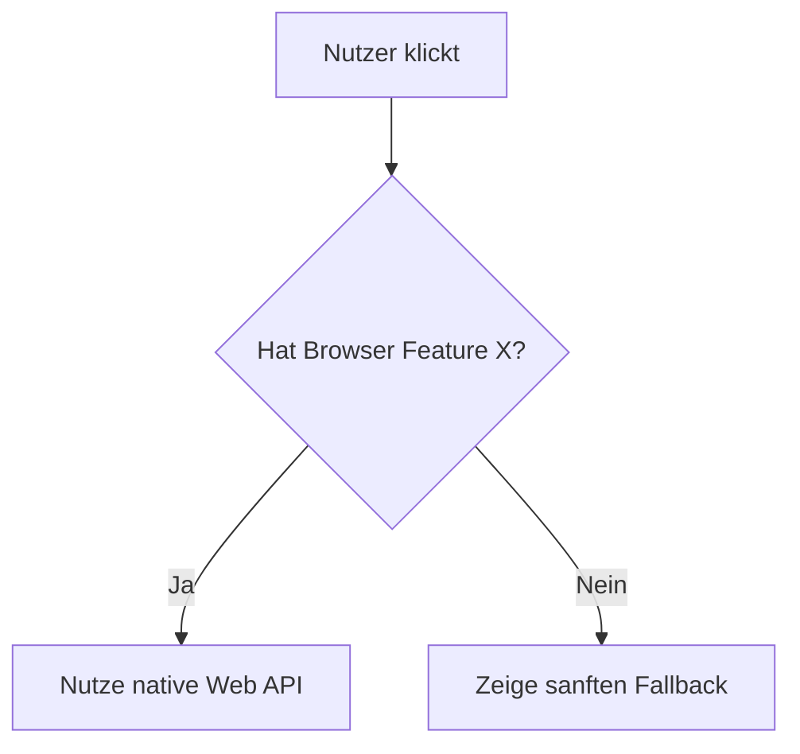

# Architectural Decision Record (ADR): [Titel]

> [!info] Info-Block (Hintergrund)
> Dies ist ein Template. Nutze diese Callouts (`> [!info]`, `> [!warning]`, `> [!danger]`, `> [!tip]`), um wichtige kontextuelle Informationen für andere Entwickler oder KI-Agenten hervorzuheben. Sie verbessern die Lesbarkeit enorm.

## 1. Kontext & Problemstellung

Beschreibe hier das Problem, das gelöst werden muss. Verlinke gerne auf andere Dokumente mit Wiki-Links, z. B. [[longevity-guidelines]].

<details>
<summary>Historischer Kontext (Klicken zum Ausklappen)</summary>
Nutze das `<details>`-Tag, um sehr lange oder sekundäre Erklärungen zu verstecken, damit das Dokument beim ersten Überfliegen übersichtlich bleibt.
</details>

## 2. Betrachtete Optionen

Nutze Tabellen, um verschiedene technische Lösungswege strukturiert gegenüberzustellen:

| Option | Vorteil | Nachteil |
| :--- | :--- | :--- |
| **Option A** (Native API) | Zero Dependencies, rasend schnell | Braucht modernen Browser (Chrome 148+) |
| **Option B** (npm Library) | Abwärtskompatibel | Bläht das Bundle auf, Sicherheitsrisiko |

## 3. Die Entscheidung

> [!success] Wir haben uns für **Option A** entschieden.

### Begründung
Nutze hier einfache Checklisten, um Argumente oder Anforderungen abzuhaken:
- [x] Entspricht der Zero-JS-Philosophie
- [x] Erfüllt den 100% Fitness Score
- [ ] Unterstützt veraltete IE11-Browser (bewusst ignoriert)

## 4. Architektur-Diagramm

Nutze Mermaid-Diagramme, um Workflows oder Datenflüsse visuell darzustellen (anstatt sie nur in Textform zu erklären):



## 5. Feature Checks (Living Documentation)

Falls diese Entscheidung auf modernen Browser-APIs basiert, deklariere den nativen Feature-Check hier. Der Compiler (`tools/build_healthcheck.js`) zieht diesen Block automatisch heraus und baut daraus die Test-Suite für die Website:

```javascript feature-check
// Erklärung: Dieser Block wird aus dem Markdown gelesen. Er darf keinen echten Code ausführen, 
// sondern nur die 'f()'-Funktion für den Healthcheck aufrufen!
// Beispiel: f("Feature Name", typeof globalThis.Feature !== "undefined", "Chrome 120", "Produktiv")
```
