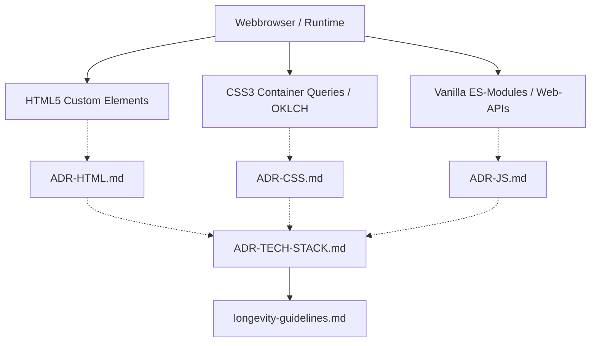
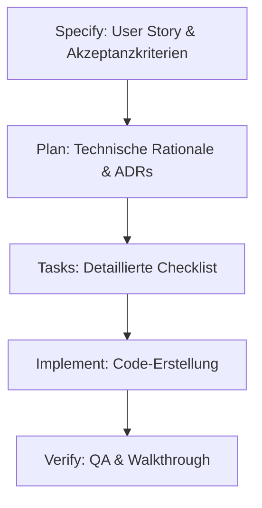

# DIN-BriefNEO: Pure Refactored Edition

Willkommen im offiziellen Repository von **DIN-BriefNEO (Pure Refactored Edition)**. 

Dieses Projekt ist eine datenschutzkonforme, 100% offline-fähige und wartungsfreie Web-Applikation zur pixelperfekten Erstellung normkonformer Briefe nach dem offiziellen deutschen Standard **DIN 5008 (Form A und Form B)**.

---

## 🏛️ Die unbiegsame W3C-Verfassung (Longevity Covenant)

Dieses Projekt bricht radikal mit der Kurzlebigkeit moderner Web-Frameworks. Wir vertrauen zu 100% auf native, standardisierte W3C/WHATWG-Schnittstellen. Unser Ziel ist eine **Überlebensspanne von 10+ Jahren ohne eine einzige Zeile Wartungsaufwand**.

*   📚 **[Longevity Guidelines (longevity-guidelines.md)](Guides/longevity-guidelines.md):** Die unverrückbare „Verfassung“ dieses Repositories. Sie deklariert die 5 Säulen der Langlebigkeit (Zero-Dependency-Pakt, 100% Offline-Autarkie, W3C-Living-Standards, Build-Tool-Immunität, LocalStorage-Sovereignty) und tabelliert alle verbotenen Legacy-Techniken (wie `document.execCommand` oder OPFS/IndexedDB unter `file://`) samt deren modernen Alternativen.
*   ⚖️ **[Master Lawbook (MASTER-DO-DONT-DEPRECATED.md)](MASTER-DO-DONT-DEPRECATED.md):** Die zentrale, erschöpfende Referenz für alle technologischen Entscheidungen, Verbote und legacy-freie Ersatzstrategien. Es dient als SSoT-Gesetzbuch für Entwickler und KIs.

---

## 📂 Dokumenten-Landkarte & Wegweiser

Um das Projekt übersichtlich und hochgradig transparent zu halten, ist die Dokumentation in modular verlinkte Single Sources of Truth (SSoTs) gegliedert:

### 🌟 Status & Spezifikationen
*   📄 **[System-Spezifikation (spec.md)](spec.md):** Beschreibt die Kernanforderungen und Akzeptanzkriterien der Baseline-Features (1 bis 6) sowie die ruhende Feature-Roadmap für Phase 3 im Backlog.
*   📋 **[Aktive Taskliste (tasks.md)](tasks.md):** Unser detaillierter Abarbeitungs-Fahrplan zur Verfolgung aller Planungs- und Refactoring-Schritte.
*   🛠️ **[Entwicklerbereich & Feature-Prüfung (DEV-INFO.md)](DEV-INFO.md):** Die zentrale Diagnose-Ansicht und Feature-Erkennungs-Matrix basierend auf dem Chrome 147+ Baseline-Check. Enthält ein kopierbares F12-Konferenz-Skript zur Bereitschaftsprüfung.
*   🗄️ **[LLM-First Datenbank-Guide (README-DB.md)](README-DB.md):** Die Spezifikation unserer serverlosen, hybrid-kompilierten SQLite-Dokumenten-Datenbank und der MCP-Architektur für KI-Assistenten.
*   📜 **[AGENTS.md (Verhaltensvertrag für KI-Agenten)](../AGENTS.md):** Bindender Vertrag für alle KI-gestützten Arbeiten. Definiert Reconciliation Loop, Evolutionary Fitness Score (Ziel 100 %), zwingende Pre-/Post-Builds, Session-Logging mit `log_session.js` sowie die explizite Rolle von DIN-Brief Neo als Testballon für die generische llm_boilerplate („Testen → Verfeinern → Generalisieren“).

### ⚡ Aktueller Entwicklungsansatz (Light Mode vs. Full Mode)

Um Komplexität und Fehleranfälligkeit zu minimieren, nutzen wir einen **gestuften Workflow**:

| Modus       | Wann?                              | Schritte (immer: Pre-Build → Änderung → Post-Build 100% → Log) | Zusätzlich                                                                 | Dokumentation                          |
|-------------|------------------------------------|----------------------------------------------------------------|----------------------------------------------------------------------------|----------------------------------------|
| **Light Mode** (Default) | Bugfixes, kleine Refactorings, kleine Anpassungen (~70-80% der Arbeit) | Pre + Änderung + Post (100%) + Log                             | Kurzer Generalisierungs-Vermerk (1-2 Sätze) im `DECISION-LOG.md`          | Minimal, im DECISION-LOG              |
| **Full Mode**     | Wichtige Features, Architektur, boilerplate-relevante Arbeit     | Wie Light + strukturierter Prozess                             | `specs/NNN-name/spec.md` (mit ausführlichem Generalisierungs-Check), optional plan.md/tasks.md + vollen Hybrid-Workflow | Explizit im Spec + DECISION-LOG + Roadmap |

Core Rules (Builds, 100% Fitness, Logging, Generalisierungs-Pflicht) gelten **immer**. Siehe `AGENTS.md` und `HYBRID-SPEC-DRIVEN-WORKFLOW.md` für Details.

### 📐 Architektur-Entscheidungen (ADR)
Alle grundlegenden Design-Entscheidungen sind thematisch im Ordner **`[ADR/](ADR/)`** modular dokumentiert und untereinander vernetzt:
*   🌐 **[ADR-HTML.md](ADR/ADR-HTML.md):** Custom Elements (IMR 4.0), native Popover API, striktes `contenteditable="plaintext-only"`-Sicherheitskonzept und Barrierefreiheit.
*   🎨 **[ADR-CSS.md](ADR/ADR-CSS.md):** Proportionaler Zoom (`94vh`), Container Queries (`cqw`/`cqh`) und native Farbthematisierung via `light-dark()`.
*   ⚡ **[ADR-JS.md](ADR/ADR-JS.md):** JavaScript-Reglementierung, Selection & Range API Formatierungen und XSS-Paste-Filter.
*   📡 **[ADR-API.md](ADR/ADR-API.md):** Dual-Provider Autocomplete (Photon keyless / Geoapify secure), API-Header-Security, PLZ-Lookups und Race-Condition-Aborting via AbortController.
*   🚫 **[ADR-ANTIPATTERN.md](ADR/ADR-ANTIPATTERN.md):** Das strikte Verbot von Frameworks, externen CDNs, Google Fonts, OPFS/IndexedDB unter `file://` und Scrollbalken.
*   🛠️ **[ADR-FEATURE.md](ADR/ADR-FEATURE.md):** WhatsApp-Selection-Popover, Toast-Queue-Lifecycles, Offline-Schriften-Manager und Proximity-Biasing.
*   📊 **[ADR-TECH-STACK.md](ADR/ADR-TECH-STACK.md):** Die zentrale tabellarische Übersicht über alle verwendeten modernen Webtechnologien und deren Rationale.

### 🔍 Bestandsaufnahmen & Roadmaps
*   📋 **[Feature-Bestandsaufnahme (FEATURE-INVENTORY.md)](FEATURE-INVENTORY.md):** Ein vollständiges, tabellarisches Inventar aller fertig implementierten Baseline-Funktionen und der dahinterstehenden W3C-Techniken.
*   🧭 **[Modernisierungs-Leitfaden (MODERNIZATION-GUIDE.md)](MODERNIZATION-GUIDE.md):** Eine strategische Gegenüberstellung aktueller Techniken mit zukünftigen W3C-Kandidaten (z. B. *CSS Anchor Positioning* oder *Temporal API*) zur Vermeidung von technischer Schuld.
*   💡 **[Zukunfts-Roadmap (ROADMAP.md)](ROADMAP.md):** Eine unverbindliche Ideensammlung für Zukunftsplanungen außerhalb des Spezifikations-Umfangs (z. B. Mehrseiten-Karussell, dictation).

---

## 📊 System-Visualisierungen & Lifecycles

Die folgenden Diagramme veranschaulichen die Architektur und unseren Entwicklungs-Lifecycle:

### A. Systemarchitektur-Übersicht
Zeigt, wie der Webbrowser als alleinige Laufzeitumgebung direkt auf nativen W3C-Standards aufbaut und wie sich die Dokumentationsstruktur darum spannt:

### B. Der Spec-First-Planungs-Lifecycle
Zeigt unseren disziplinierten Ablauf für nachhaltiges Refactoring:

---

## ⚡ Lokaler Schnellstart (Doppelklick-Kompatibel)

Dank der radikalen Build-Tool-Immunität benötigt dieses Projekt **kein NPM, kein Node.js, keine Server und keine Installation**.

1.  Klone oder lade dieses Repository herunter.
2.  Navigiere in den Ordner **`[website/](website/)`**.
3.  Öffne die Datei **`index.html`** per einfachem Doppelklick in deinem Chrome- oder Edge-Browser (`file:///index.html`).
4.  Der Briefbogen ist sofort einsatzbereit, speichert deinen Entwurf lokal auf deinem Rechner und ist zu 100% offline-fähig!

---

## 📐 Physische DIN-Abstandsdaten

Die hochpräzisen, physischen DIN-Abstände für Locher, Faltmarken, Anschriftfeld und Briefkern gemäß der offiziellen DIN 5008 Norm findest du in unserem Master-Guide:
*   📘 **[DIN 5008 Geometry Master Data (Guides/din-5008-geometry.md)](Guides/din-5008-geometry.md)**

---

**Wir bauen kein kurzlebiges MVP – wir bauen ein digitales Denkmal.**
