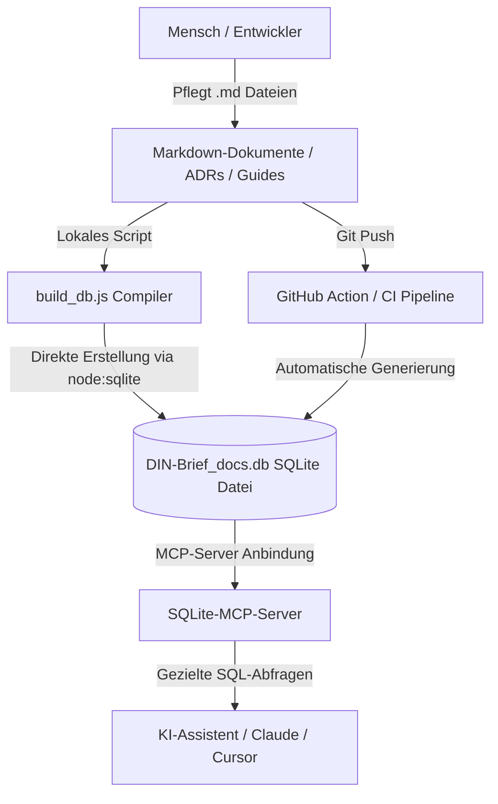

# DIN-BriefNEO — LLM-First Dokumenten-Datenbank & MCP-Architektur

Dieses Dokument spezifiziert die Architektur und Nutzung unserer **LLM-first Dokumenten-Datenbank** (`DIN-Brief_docs.db`). Um KIs (Large Language Models) einen blitzschnellen, strukturierten und token-schonenden Zugriff auf das gesamte Projektwissen zu ermöglichen, kompilieren wir unsere Markdown-Dokumente automatisch in eine relationale SQLite-Datenbank.

Durch die Kopplung mit einem **Model Context Protocol (MCP) Server** kann deine KI über gezielte SQL-Abfragen in Millisekunden genau die benötigten Informationen extrahieren, anstatt riesige Kontextmengen laden zu müssen.

---

## Das Hybrid-Architekturmodell (FTS5 Goldstandard)

Wir trennen strikt zwischen Pflege und Konsum der Dokumentation. Der Kompilierungsprozess läuft vollkommen direkt und abhängigkeitsfrei in Node.js:



1. **Master Source of Truth (Markdown):** Alle ADRs, Guides und Spezifikationen werden als menschenlesbare, hervorragend in Git versionierbare `.md`-Dateien gepflegt.

2. **Direkter Node-Compiler (Zero-Dependency):** Über das moderne, in Node.js eingebaute native Modul `node:sqlite` wird die SQLite-Datei `DIN-Brief_docs.db` direkt und performant in einer Transaktion generiert, ohne auf externe Binaries (`sqlite3.exe`) oder schwere npm-Pakete (`better-sqlite3`) angewiesen zu sein.

3. **Schnittstelle (MCP):** Das LLM kommuniziert nicht mit Rohdateien, sondern stellt über standardisierte Werkzeuge des SQLite-MCP-Servers präzise relationale Abfragen an die Datenbank.

---

## Das Datenbankschema

Die Datenbank `DIN-Brief_docs.db` ist relational normalisiert und gleichzeitig für ultraschnelles Retrieval denormalisiert aufgebaut:

### Tabelle: `documents`

Enthält die Kerninformationen aller Systemdokumente.

- `id` (INTEGER, Primary Key, Auto-Increment)
- `path` (TEXT, Unique, Not Null) — Der relative Pfad zum Dokument (z.B. `ADR/ADR-CSS.md`)
- `title` (TEXT, Not Null) — Der aus dem YAML Frontmatter extrahierte Titel
- `status` (TEXT) — Der aktuelle Status des Dokuments (z.B. `active`)
- `content` (TEXT, Not Null) — Der bereinigte Markdown-Inhalt (ohne YAML-Header)
- `tags` (TEXT) — Alle Schlagworte als leerzeichengetrennter Plaintext, benötigt für den FTS5 External Content Sync.

### Tabelle: `document_tags`

Ermöglicht eine 1:n Verknüpfung von Schlagworten für hochpräzise relationale Filterung.

- `document_id` (INTEGER, Foreign Key → `documents(id)` on delete cascade)
- `tag` (TEXT, Not Null)
- Composite Primary Key: `(document_id, tag)`
- Sekundärindex: `idx_document_tags_tag`

### Virtuelle Tabelle: `documents_fts` (Full-Text Search 5)

- Engine: SQLite FTS5
- Spalten: `content`, `title`, `path`, `tags`
- Externe Inhaltstabelle: Gekoppelt mit `documents` über `content='documents'` — vermeidet Daten-Redundanz
- Tokenizer: `unicode61` (diakritika-resistent für Umlaute ä, ö, ü, ß)
- Prefix-Indizes: `prefix='2 3'` für Autovervollständigung

Automatische Synchronisations-Trigger: `tbl_ai` (AFTER INSERT), `tbl_ad` (AFTER DELETE), `tbl_au` (AFTER UPDATE).

---

## Abfrage-Beispiele & Views

### View: `v_accepted_adrs`

```sql
SELECT id, path, title, status, tags FROM v_accepted_adrs;
```

### View: `v_active_docs`

```sql
SELECT id, path, title, status, tags FROM v_active_docs;
```

### Hybride Volltext- & Schlagwortsuche

```sql
SELECT title, path 
FROM documents_fts 
WHERE documents_fts MATCH 'tags:css AND popover';
```

---

## Generierung & Kompilierung

```powershell
# Aus aktueller_arbeitsordner/ ausführen:
node tools/build_db.js
# oder alternativ:
python tools/build_db.py
```

Das Skript löscht die alte DB-Datei zur Konsistenzsicherung und kompiliert die neue `DIN-Brief_docs.db` direkt über Node.js (Zero-Dependency — kein npm install nötig).

---

## Verweise

- [[Immutable-Law-Catalog]] — Unumstößliches Gesetzbuch für technologische Verbote
- [[longevity-guidelines]] — W3C-Longevity-Verfassung
- [[sqlite-vec]] — Geplante Hybrid-Search-Erweiterung (FTS5 + Semantic Embeddings)
