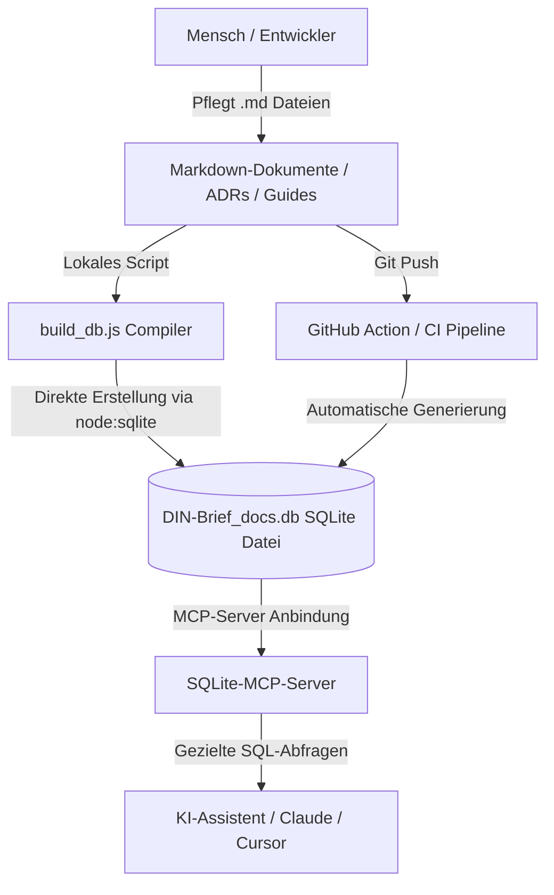

# 🗄️ DIN-BriefNEO — LLM-First Dokumenten-Datenbank & MCP-Architektur

Dieses Dokument spezifiziert die Architektur und Nutzung unserer **LLM-first Dokumenten-Datenbank** (`DIN-Brief_docs.db`). Um KIs (Large Language Models) einen blitzschnellen, strukturierten und token-schonenden Zugriff auf das gesamte Projektwissen zu ermöglichen, kompilieren wir unsere Markdown-Dokumente automatisch in eine relationale SQLite-Datenbank.

Durch die Kopplung mit einem **Model Context Protocol (MCP) Server** kann deine KI über gezielte SQL-Abfragen in Millisekunden genau die benötigten Informationen extrahieren, anstatt riesige Kontextmengen laden zu müssen.

---

## 🏛️ Das Hybrid-Architekturmodell (FTS5 Goldstandard)

Wir trennen strikt zwischen Pflege und Konsum der Dokumentation. Der Kompilierungsprozess läuft vollkommen direkt und abhängigkeitsfrei in Node.js:



1. **Master Source of Truth (Markdown):** Alle ADRs, Guides und Spezifikationen werden als menschenlesbare, hervorragend in Git versionierbare `.md`-Dateien gepflegt.
2. **Direkter Node-Compiler (Zero-Dependency):** Über das moderne, in Node.js eingebaute native Modul `node:sqlite` wird die SQLite-Datei `DIN-Brief_docs.db` direkt und performant in einer Transaktion generiert, ohne auf externe Binaries (`sqlite3.exe`) oder schwere npm-Pakete (`better-sqlite3`) angewiesen zu sein.
3. **Schnittstelle (MCP):** Das LLM kommuniziert nicht mit Rohdateien, sondern stellt über standardisierte Werkzeuge des SQLite-MCP-Servers präzise relationale Abfragen an die Datenbank.

---

## 📊 Das Datenbankschema

Die Datenbank `DIN-Brief_docs.db` ist relational normalisiert und gleichzeitig für ultraschnelles Retrieval denormalisiert aufgebaut:

### 1. Tabelle: `documents`
Enthält die Kerninformationen aller Systemdokumente.

*   `id` (INTEGER, Primary Key, Auto-Increment)
*   `path` (TEXT, Unique, Not Null) — Der relative Pfad zum Dokument (z. B. `ADR/ADR-CSS.md`)
*   `title` (TEXT, Not Null) — Der aus dem YAML Frontmatter extrahierte Titel
*   `status` (TEXT) — Der aktuelle Status des Dokuments (z. B. `accepted`, `active`)
*   `content` (TEXT, Not Null) — Der bereinigte Markdown-Inhalt (ohne YAML-Header)
*   `tags` (TEXT) — Alle Schlagworte als leerzeichengetrennter Plaintext (z. B. `'css layout containers'`), benötigt für den FTS5 External Content Sync.

### 2. Tabelle: `document_tags`
Ermöglicht eine 1:n Verknüpfung von Schlagworten für eine hochpräzise relationale Filterung.

*   `document_id` (INTEGER, Foreign Key referencing `documents(id)` on delete cascade)
*   `tag` (TEXT, Not Null) — Das Schlagwort (z. B. `css`, `popover`, `security`)
*   *Composite Primary Key:* `(document_id, tag)`
*   *Sekundärindex:* `idx_document_tags_tag` auf die Spalte `tag` zur Beschleunigung von relationalen Schlagwortabfragen.

### 3. Virtuelle Tabelle: `documents_fts` (Full-Text Search 5)
Die hochoptimierte FTS5-Such-Engine für hybride Volltext- und Schlagwortabfragen.

*   *Engine:* SQLite FTS5 (Volltextsuche)
*   *Spalten:* `content`, `title`, `path`, `tags`
*   *Externe Inhaltstabelle:* Gekoppelt mit `documents` über `content='documents'` und `content_rowid='id'`. Dies vermeidet Daten-Redundanz und hält die FTS-Abfragen extrem speichereffizient.
*   *Tokenizer:* `unicode61` (Speziell für deutsche Inhalte optimiert; diakritika-resistent für Umlaute `ä`, `ö`, `ü`, `ß` und frei von englischen Stemming-Verzerrungen).
*   *Prefix-Indizes:* Konfiguriert mit `prefix='2 3'`, um blitzschnelle Autovervollständigungen und Präfix-Suchen (z. B. `anch*`) zu unterstützen.

#### 🔄 Automatische Synchronisations-Trigger
Die FTS5-Volltexttabelle wird durch drei integrierte SQLite-Trigger vollautomatisch mit der Quelltabelle `documents` synchron gehalten:
*   `tbl_ai` (AFTER INSERT)
*   `tbl_ad` (AFTER DELETE)
*   `tbl_au` (AFTER UPDATE)

---

## ⚡ Abfrage-Beispiele & Views (SQL-Leitfaden für KIs)

KIs können direkt auf vordefinierte, hochperformante Views zugreifen, die komplexe Abfragen kapseln:

### 1. View: `v_accepted_adrs`
Gibt alle akzeptierten ADRs mit ihren Tags zurück (Filterung in $O(1)$ über das `documents.tags` Feld):
```sql
SELECT id, path, title, status, tags FROM v_accepted_adrs;
```

### 2. View: `v_active_docs`
Gibt alle aktiven Systemdokumente zurück (perfekt für das globale RAG-Retrieval):
```sql
SELECT id, path, title, status, tags FROM v_active_docs;
```

### 3. View: `v_document_index`
Ein schlanker Index aller erfassten Dokumente:
```sql
SELECT id, path, title, status, tags FROM v_document_index;
```

### 4. Hybride Volltext- & Schlagwortsuche via FTS5 MATCH
Findet alle Dokumente mit dem Tag `css`, die das Wort `popover` im Inhalt oder Titel besitzen:
```sql
SELECT title, path 
FROM documents_fts 
WHERE documents_fts MATCH 'tags:css AND popover';
```

---

## ⚙️ Generierung & Kompilierung

### A. Lokale Generierung (Entwickler-Befehl)
Führe im Hauptverzeichnis des Projekts einfach folgendes PowerShell-Skript aus, um die Datenbank aus den aktuellen Markdown-Dateien zu kompilieren:

```powershell
powershell -ExecutionPolicy Bypass -File C:\Users\morit\Documents\Update_DIN-Brief_DB.ps1
```

Das Skript löscht die alte DB-Datei zur Konsistenzsicherung und kompiliert die neue `DIN-Brief_docs.db` direkt über Node.js.

---

## 🔗 Verweise
*   ⚖️ **[Immutable Law Catalog](../00-foundation/Immutable-Law-Catalog.md):** Unser unumstößliches Gesetzbuch für technologische Verbote.
*   📚 **[longevity-guidelines.md](../00-foundation/longevity-guidelines.md):** Die übergeordnete W3C-Verfassung.
*   🛠️ **[DEV-INFO.md](../30-meta/DEV-INFO.md):** Unsere 25-Feature Diagnose- und Feature-Erkennungs-Matrix.


## 🔍 Aktueller Status der Vektor-Suche (Semantic Search)
Es ist geplant, die reine FTS5-Volltextsuche durch eine **Hybrid Search (Volltext + semantische Suche)** zu ersetzen.
Dazu soll die Erweiterung `sqlite-vec` integriert werden, welche die Speicherung von Embeddings und Vektor-Distanzen nativ in SQLite erlaubt.
Der detaillierte Implementierungsplan liegt unter: **[docs/implementation/sqlite-vec.md](../20-implementation/implementation/sqlite-vec.md)**.
