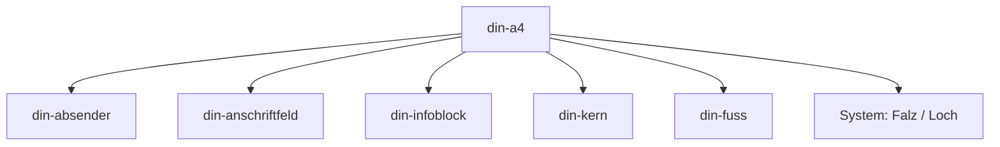

# IMR 4.0 — DIN 5008 Registry

Die IMR-Registry ist das normative Master-Modell des DIN-Briefes. Sie definiert Vokabular, kanonische Tags, Zonen, Beziehungen und belegte normative Geometrie. HTML implementiert dieses Modell, CSS rendert es, JavaScript erzeugt keine konkurrierende normative Geometriequelle.

Die 45 Atome (`8+8+8+6+12+3`) sind das vollständige fachliche Vokabular. Ein konkreter Brief instantiiert nur die benötigte Teilmenge. Nicht-Vorkommen ist kein Fehler. Ein instantiiertes Atom wird als kanonisches `<din-…>`-Element repräsentiert. Das verlangt keine JavaScript-Registrierung und keine Custom-Element-Klasse.

Es gibt keine Atome 46 oder 47. Overlay ist keine der 45.

> [!NOTE]
> Das Anschriftfeld hat eine feste Höhe von 45 mm. Überlaufender Text wird durch den Overflow-Alarm visuell markiert. Das Overflow-Verhalten selbst ist Rendering, nicht zusätzliche Atom-Geometrie.

---

## Geometrieklassen

Koordinatensystem: DIN-A4-Blatt, 210 mm × 297 mm, Ursprung oben links, Einheit Millimeter. Form A und Form B sind Y-Varianten desselben Modells.

| Klasse | Bedeutung | In dieser Registry |
|---|---|---|
| 1 Absolute Atom-Geometrie | X / Y / W / H in mm, nur wenn belegt | nur die bereits belegten Werte |
| 2 Zonen-Geometrie | Begrenzung der Zone | nur belegte Zonenmaße |
| 3 Flow- / Reihenmodell | Lage in Zone, Zeile oder Spaltenindex ohne eigene Box | explizite Regel, keine abgeleiteten mm |
| 4 Rendering | CSS, `%`, Custom Properties, Ellipsis, Zeilenhöhe als Technik | nicht normativ |

Fehlt eine belastbare absolute Atom-Box:

`absolute geometry: not independently specified`

Vorhandene Millimeterwerte werden nicht gelöscht und nicht durch Rechnung ergänzt.

---

## Komposition

`din-empfaenger-vorname` und `din-empfaenger-nachname` dürfen in einem Brief als gemeinsame Namenszeile in der Anschriftzone erscheinen. Das erzeugt kein Atom `din-empfaenger-name`. Die Split-Tags werden nur instantiiert, wenn Vor- und Nachname getrennt geführt werden.

Dasselbe gilt für `din-absender-vorname` und `din-absender-nachname` in der Zone, in der der Absenderkontakt tatsächlich liegt.

Ein optionales Unterschriftsbild ist Satellit von `din-unterschrift`, kein eigenes Atom.

---

## Platzierung Kontakt

Die acht Absender-Atome haben die Default-Zone `din-absender` (Briefkopf).

Sie MAY in `din-infoblock` liegen, wenn der konkrete Brief den Kontakt rechts führt.

Dieselbe Angabe darf nicht parallel in Briefkopf und Infoblock instantiiert werden.

---

## Ebenen

```
din-a4                         Dokumentrahmen 210 × 297, kein Atom
├── din-absender               ZONE Briefkopf (optional)
├── din-anschriftfeld          ZONE Fenster
├── din-infoblock              ZONE rechts
├── din-datum                  Atom (Metadaten-Gruppe; DOM-Kindschaft nicht zwingend)
├── din-kern                   ZONE Briefkörper
├── din-fuss                   ZONE Fuß
├── din-falz-oben              SYSTEM-Atom
├── din-falz-unten             SYSTEM-Atom
└── din-lochmarke              SYSTEM-Atom
```

Zonen sind keine der 45 Atome.



---

## Übersicht 45 Atome

| Bereich | Anzahl | Zone / Gruppe |
|---|---|---|
| Absender | 8 | `<din-absender>` Default; MAY Infoblock |
| Anschrift | 8 | `<din-anschriftfeld>` |
| Infoblock | 8 | `<din-infoblock>` / Datum eigene Y |
| Kern | 6 | `<din-kern>` |
| Fuß | 12 | `<din-fuss>` |
| System | 3 | Blatt, keine Inhaltszone |
| **Summe** | **45** | |

---

## 0. Dokumentrahmen

**Element:** `<din-a4>`  
**Rolle:** Dokumentwurzel, nicht Teil der 45.  
**Normative Fläche:** Breite 210 mm, Höhe 297 mm.

### Form A und Form B

Dasselbe Blatt, dieselben Zonen und Atome. Form A und Form B unterscheiden sich nur durch belegte **Y-Lagen**. Es ist keine zweite Dokumentart und kein drittes Layout.

Belegte Y-Paare (bereits in den Zonen- und Systemabschnitten):

| Objekt | Y Form A | Y Form B |
|---|---|---|
| Zone `din-absender` | 27 mm | 45 mm |
| Zone `din-anschriftfeld` | 32 mm | 50 mm |
| Zone `din-infoblock` | 32 mm | 50 mm |
| Atom `din-datum` | 74 mm | 92 mm |
| Zone `din-kern` | 91 mm | 109 mm |
| Atom `din-falz-oben` | 87 mm | 105 mm |
| Atom `din-falz-unten` | 181 mm | 210 mm |

Unverändert zwischen den Formen, soweit belegt: Blatt 210 × 297, Anschrift W 85 H 45, Infoblock X 125, Kern X 25 W 165, Fuß X 25 Y 241 W 165, Lochung Y 148,5 mm.

Wie HTML den Form-Schalter speichert und wie CSS die Y-Werte umsetzt, ist Rendering, nicht Teil dieses Modells.

---

## 1. Zone Absender (Briefkopf)

**Zone:** `<din-absender>`  
**Rolle:** optionaler Briefkopf. Keine Pflicht, alle acht Atome zu instantiieren.  
**Zonen-Geometrie:** X 25 mm. Y Form A 27 mm, Form B 45 mm. Breite und Höhe der Zone: `absolute geometry: not independently specified`.

| Atom | Tag | Ausrichtung | Atom-Geometrie | Modell |
|---|---|---|---|---|
| din-branding-logo | `<din-branding-logo>` | rechts | not independently specified | available |
| din-absender-vorname | `<din-absender-vorname>` | links | not independently specified | Flow in Zonenbox; Komposition mit Nachname zulässig |
| din-absender-nachname | `<din-absender-nachname>` | links | not independently specified | Flow in Zonenbox; Komposition mit Vorname zulässig |
| din-absender-strasse | `<din-absender-strasse>` | links | not independently specified | Flow in Zonenbox |
| din-absender-ort | `<din-absender-ort>` | links | not independently specified | Flow in Zonenbox |
| din-absender-zusatz | `<din-absender-zusatz>` | links | not independently specified | Flow in Zonenbox |
| din-absender-mail | `<din-absender-mail>` | links | not independently specified | Flow in Zonenbox; MAY Infoblock |
| din-absender-tel | `<din-absender-tel>` | links | not independently specified | Flow in Zonenbox; MAY Infoblock |

Fachliche Bezüge: DIN 5008 Absenderangaben. Keine CSS-Custom-Property ist Teil dieser Normwerte.

---

## 2. Zone Anschriftfeld

**Zone:** `<din-anschriftfeld>`  
**ARIA:** `group`  
**Zonen-Geometrie:** X 25 mm. Y Form A 32 mm, Form B 50 mm. Breite 85 mm. Höhe 45 mm (fix).

Die Höhe 45 mm ist Zonenmaß, keine Atom-Box.

| Atom | Tag | Reihenmodell | Atom-Geometrie | Modell |
|---|---|---|---|---|
| din-rucksendezeile | `<din-rucksendezeile>` | Zeile 1 | not independently specified | Kleinstzeile im Fenster; nicht identisch mit Zone `din-absender` |
| din-postvermerk | `<din-postvermerk>` | Zeile 1–4 | not independently specified | optional |
| din-empfaenger-firma | `<din-empfaenger-firma>` | Zeile 5–9 | not independently specified | optional |
| din-empfaenger-abteilung | `<din-empfaenger-abteilung>` | Zeile 5–9 | not independently specified | optional |
| din-empfaenger-vorname | `<din-empfaenger-vorname>` | Zeile 5–9 | not independently specified | Komposition mit Nachname zulässig |
| din-empfaenger-nachname | `<din-empfaenger-nachname>` | Zeile 5–9 | not independently specified | Komposition mit Vorname zulässig |
| din-empfaenger-strasse | `<din-empfaenger-strasse>` | Zeile 5–9 | not independently specified | |
| din-empfaenger-ort | `<din-empfaenger-ort>` | Zeile 5–9 | not independently specified | |

Schriftgröße 8 pt der Rücksendezeile ist ein typografischer Parameter, keine Millimeter-Box.

---

## 3. Zone Infoblock (Metadaten)

**Zone:** `<din-infoblock>`  
**ARIA:** `group`  
**Zonen-Geometrie:** X 125 mm. Y Form A 32 mm, Form B 50 mm. Breite und Höhe der Zone: `absolute geometry: not independently specified`.

Kontakt-Atome der Absendergruppe MAY hier instantiiert werden (siehe Platzierung).

| Atom | Tag | Lage | Atom-Geometrie | Modell |
|---|---|---|---|---|
| din-datum | `<din-datum>` | Y Form A 74 mm, Form B 92 mm | Y belegt; X/W/H not independently specified | Metadaten-Gruppe; muss nicht DOM-Kind von `din-infoblock` sein |
| din-ihr-zeichen | `<din-ihr-zeichen>` | Flow in der Zone | not independently specified | available |
| din-ihr-schreiben | `<din-ihr-schreiben>` | Flow in der Zone | not independently specified | available |
| din-unser-zeichen | `<din-unser-zeichen>` | Flow in der Zone | not independently specified | available |
| din-unser-schreiben | `<din-unser-schreiben>` | Flow in der Zone | not independently specified | available |
| din-durchwahl | `<din-durchwahl>` | Flow in der Zone | not independently specified | nicht identisch mit `din-absender-tel` |
| din-email-direkt | `<din-email-direkt>` | Flow in der Zone | not independently specified | nicht identisch mit `din-absender-mail` |
| din-internet | `<din-internet>` | Flow in der Zone | not independently specified | available |

---

## 4. Zone Briefkern

**Zone:** `<din-kern>`  
**Zonen-Geometrie:** X 25 mm. Y Form A 91 mm, Form B 109 mm. Breite 165 mm. Höhe der Zone: `absolute geometry: not independently specified`.

Der Betreff beginnt fachlich unter der ersten Falzmarke. Die Falz-Y-Werte stehen nur bei den System-Atomen.
Normative Kollisionsvermeidung (ehemals ADR-BETREFF): Falzmarken dürfen nicht in die Zone `din-kern` hineinragen oder den Betreff optisch durchschneiden. Sie werden am linken Blattrand auf eine funktionale Markierungslänge von 8 mm beschränkt.

| Atom | Tag | Modell | Atom-Geometrie |
|---|---|---|---|
| din-betreff | `<din-betreff>` | Flow in der Zone; höchstens zwei Zeilen als fachliche Empfehlung; dynamischer Dateinamen-Anker | not independently specified |
| din-anrede | `<din-anrede>` | Flow in der Zone | not independently specified |
| din-text | `<din-text>` | mehrzeilig, wächst in der Zone | not independently specified |
| din-grussformel | `<din-grussformel>` | Flow in der Zone | not independently specified |
| din-unterschrift | `<din-unterschrift>` | Flow in der Zone; Bild optional als Satellit | not independently specified |
| din-anlagen | `<din-anlagen>` | mehrzeilig, optional | not independently specified |

Blocksatz und Silbentrennung sind Rendering.

---

## 5. Zone Fuß

**Zone:** `<din-fuss>`  
**ARIA:** `contentinfo`  
**Zonen-Geometrie:** X 25 mm. Y 241 mm. Breite 165 mm. Höhe der Zone: `absolute geometry: not independently specified`.

Layout in vier Spalten ist Rendering. Normativ belegt sind die Y-Reihen und der Spaltenindex, nicht die Millimeter-X/W der einzelnen Atome.

| Atom | Tag | Spalte | Y (mm) | Atom-X/W/H |
|---|---|---|---|---|
| din-fuss-firma | `<din-fuss-firma>` | 1 | 241 | not independently specified |
| din-fuss-sitz | `<din-fuss-sitz>` | 1 | 246 | not independently specified |
| din-fuss-gericht | `<din-fuss-gericht>` | 1 | 251 | not independently specified |
| din-fuss-hrb | `<din-fuss-hrb>` | 1 | 256 | not independently specified |
| din-fuss-vorstand | `<din-fuss-vorstand>` | 2 | 241 | not independently specified |
| din-fuss-gf | `<din-fuss-gf>` | 2 | 251 | not independently specified |
| din-fuss-stnr | `<din-fuss-stnr>` | 3 | 241 | not independently specified |
| din-fuss-ustid | `<din-fuss-ustid>` | 3 | 246 | not independently specified |
| din-fuss-bank | `<din-fuss-bank>` | 4 | 241 | not independently specified |
| din-fuss-iban | `<din-fuss-iban>` | 4 | 246 | not independently specified |
| din-fuss-bic | `<din-fuss-bic>` | 4 | 251 | not independently specified |
| din-fuss-anschrift | `<din-fuss-anschrift>` | 4 | 256 | not independently specified |

Spalte 2 hat in diesem Modell keine belegte Zeile bei Y 246. Das bleibt eine Lücke, kein neuer Wert.

---

## 6. System

Genau drei Atome. Sie liegen auf dem Blatt, nicht in einer Inhaltszone.

| Atom | Tag | Belegte Geometrie | Nicht belegt |
|---|---|---|---|
| din-falz-oben | `<din-falz-oben>` | Y Form A 87 mm, Form B 105 mm, X 0 mm, W 8 mm | H |
| din-falz-unten | `<din-falz-unten>` | Y Form A 181 mm, Form B 210 mm, X 0 mm, W 8 mm | H |
| din-lochmarke | `<din-lochmarke>` | Y 148,5 mm, X 0 mm, W 8 mm | H |

Die Breite von exakt 8 mm am linken Papierrand verhindert jede optische Kollision mit dem Betreff- oder Textbereich (ehemals ADR-BETREFF).

### Overlay (kein Atom)

Eine optionale visuelle Hilfsebene für Layout-Kontrolle. Sie gehört nicht zu den 45 Atomen und hat keine normative Atom-Geometrie in diesem Modell.

---

## Changelog

| Datum | Änderung |
|---|---|
| 2026-09-02 | Master-Modell: Zonen, Komposition, Kontakt-Platzierung, Overlay außerhalb der 45, Geometrie klassifiziert, Form A/B am Dokumentrahmen |
| 2026-03-31 | Initiale Version |
