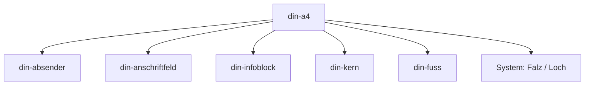

# IMR 4.0 — DIN 5008 Registry

Die IMR-Registry ist das normative Master-Modell des DIN-Briefes. Sie definiert Vokabular, kanonische Tags, Zonen, Beziehungen und belegte normative Geometrie. HTML implementiert dieses Modell, CSS rendert es, JavaScript erzeugt keine konkurrierende normative Geometriequelle.

Die 45 Atome (`8+8+8+6+12+3`) sind das vollständige fachliche Vokabular. Ein konkreter Brief instantiiert nur die benötigte Teilmenge. Nicht-Vorkommen ist kein Fehler. Ein instantiiertes Atom wird als kanonisches `<din-…>`-Element repräsentiert. Das verlangt keine JavaScript-Registrierung und keine Custom-Element-Klasse.

Es gibt keine Atome 46 oder 47. Overlay ist keine der 45.

> [!NOTE]
> Das Anschriftfeld hat eine feste Höhe von 45 mm. Überlaufender Text wird durch den Overflow-Alarm visuell markiert. Das Overflow-Verhalten selbst ist Rendering, nicht zusätzliche Atom-Geometrie.

---

## Registry Contract

Diese Registry ist die **einzige normative Quelle** für: kanonische Tags, Atom-Identität, Zonen- und System-Atom-Identität, erlaubte Beziehungen, belegte Geometrie und die Form-A/Form-B-Y-Werte. HTML, CSS und JavaScript sind **abgeleitete Implementierungen**.

**Regelvokabular:** MUST (zwingend) · MUST-NOT (verboten) · SHOULD (stark empfohlen) · MAY (zulässig).

### MUST-NOT

1. MUST-NOT: ein Atom außerhalb des 45er-Inventars definieren.
2. MUST-NOT: ein `din-*` ohne Registry-Eintrag verwenden (siehe Namespace).
3. MUST-NOT: Synonyme, Kompositionen, Satelliten, Zonen oder Rendering-Bezeichner als Atom zählen.
4. MUST-NOT: eine zweite Form oder den Dokumentrahmen als eigenes Atom-Inventar behandeln.
5. MUST-NOT: normative Geometrie in CSS oder JavaScript duplizieren.
6. MUST-NOT: `data-*`-Werte abweichend von dieser Registry pflegen (sie sind generiert, siehe „Maschinenlesbares Inventar").
7. MUST-NOT: nicht belegte X/Y/W/H-Werte rechnerisch als normativ deklarieren.
8. MUST-NOT: einen Alias oder eine Komposition ohne kanonischen Registry-Bezug verwenden.

---

## Namespace

`din-*` ist ausschließlich der kanonische Namespace dieses Modells. Jeder `din-*`-Bezeichner gehört exakt einer Kategorie an:

| Kategorie | Umfang | Beispiele |
|---|---|---|
| DOCUMENT | 1 | `din-a4` |
| ZONE | 5 | `din-absender`, `din-anschriftfeld`, `din-infoblock`, `din-kern`, `din-fuss` |
| ATOM | 42 | `din-betreff`, `din-anrede`, `din-text`, `din-fuss-iban`, … |
| SYSTEM_ATOM | 3 | `din-falz-oben`, `din-falz-unten`, `din-lochmarke` |

UI-, Rendering- und Kompositions-Bezeichner tragen **keinen** `din-`-Präfix.

---

## Geometrieklassen

Koordinatensystem: DIN-A4-Blatt, 210 mm × 297 mm, Ursprung oben links, Einheit Millimeter. Form A und Form B sind Y-Varianten desselben Modells.

| Klasse | Bedeutung | In dieser Registry |
|---|---|---|
| 1 Absolute Atom-Geometrie | X / Y / W / H in mm, nur wenn belegt | nur die bereits belegten Werte |
| 2 Zonen-Geometrie | Begrenzung der Zone | nur belegte Zonenmaße |
| 3 Flow- / Reihenmodell | Lage in Zone, Zeile oder Spaltenindex ohne eigene Box | explizite Regel, keine abgeleiteten mm |
| 4 Rendering | CSS, `%`, Custom Properties, Ellipsis, Zeilenhöhe als Technik | nicht normativ |

Fehlt eine belastbare absolute Atom-Box:

`absolute geometry: not independently specified`

Vorhandene Millimeterwerte werden nicht gelöscht und nicht durch Rechnung ergänzt.

---

## Komposition

`din-empfaenger-vorname` und `din-empfaenger-nachname` dürfen in einem Brief als gemeinsame Namenszeile in der Anschriftzone erscheinen. Das erzeugt kein Atom `din-empfaenger-name`. Die Split-Tags werden nur instantiiert, wenn Vor- und Nachname getrennt geführt werden.

Dasselbe gilt für `din-absender-vorname` und `din-absender-nachname` in der Zone, in der der Absenderkontakt tatsächlich liegt.

Ein optionales Unterschriftsbild ist Satellit von `din-unterschrift`, kein eigenes Atom.

---

## Synonym- und Alias-Registry

Erlaubte und verbotene Nicht-Atom-Bezeichner. **Kein Eintrag dieser Tabelle ist ein Atom.**

| Nicht-kanonischer Name | Typ | Kanonischer Bezug | Status |
|---|---|---|---|
| `empfaenger-namenszeile` | Komposition | `din-empfaenger-vorname` + `din-empfaenger-nachname` | erlaubt |
| `absender-namenszeile` | Komposition | `din-absender-vorname` + `din-absender-nachname` | erlaubt |
| `unterschriftsbild-*` | Satellit | `din-unterschrift` | erlaubt |
| `brief-ansicht`, `brief-kommentar` | Rendering | — (kein Atom) | erlaubt |
| `din-empfaenger-name` | Alias | zwei Split-Atome | **verboten** |
| `din-absender-name` | Alias | zwei Split-Atome | **verboten** |

Diese Liste ist maschinenlesbar im JSON-Inventar unter `vocabulary` hinterlegt; `tools/imr.js` prüft sie gegen den Code.

**Kanonisches Vokabular:** Blatt · Anschrift · Anschriftfeld · Infoblock · Briefkern · Text · Betreff · Absender · Datum · Unterschrift · Fuss · Schrift · Hinweis · Seitenleiste · Aktion · Ansicht.

**Technische Ausnahmen (nicht automatisch geprüft):** `font-family`/`font-size`/… (native CSS), `FontFace` (native API), `fontsource` (Brand), `touch-action`/`action` (native CSS bzw. JS-Schlüssel), `Adresse` (Input-Parsing: Postadresse/Anschrift-Labels), Dateinamen `sidebar.css`/`32-toast.js`.

---

## Autorität und Herkunft

Jeder normative Wert trägt seine Herkunft:

| Herkunft | Bedeutung |
|---|---|
| DIN | aus DIN 5008 abgeleitet — **gegen DIN 5008:2020-03 + Berichtigung 1:2020-07 zu verifizieren** |
| PROJECT | projektspezifische Modell-/Layoutentscheidung |
| IMPLEMENTATION | technische Umsetzung (Rendering), nicht normativ |

Als `PROJECT` geführt: die 8-mm-Begrenzung der Falz-/Lochmarken, die Kollisionsvermeidung mit dem Betreff, die feste 45-mm-Höhe des Anschriftfelds und der Form-A/B-Schalter. Die Millimeterwerte (210/297, 25/125, 27/45/32/50/74/92/91/109/87/105/181/210, 148,5) sind als `DIN` geführt und **noch zu verifizieren**.

---

## Platzierung Kontakt

Die acht Absender-Atome haben die Default-Zone `din-absender` (Briefkopf).

Sie MAY in `din-infoblock` liegen, wenn der konkrete Brief den Kontakt rechts führt.

Dieselbe Angabe darf nicht parallel in Briefkopf und Infoblock instantiiert werden.

---

## Ebenen

```
din-a4                         Dokumentrahmen 210 × 297, kein Atom
├── din-absender               ZONE Briefkopf (optional)
├── din-anschriftfeld          ZONE Fenster
├── din-infoblock              ZONE rechts
├── din-datum                  Atom (Metadaten-Gruppe; DOM-Kindschaft nicht zwingend)
├── din-kern                   ZONE Briefkörper
├── din-fuss                   ZONE Fuß
├── din-falz-oben              SYSTEM-Atom
├── din-falz-unten             SYSTEM-Atom
└── din-lochmarke              SYSTEM-Atom
```

Zonen sind keine der 45 Atome.


```mermaid
graph TD
    R[din-a4]
    R --> B[din-absender]
    R --> C[din-anschriftfeld]
    R --> D[din-infoblock]
    R --> E[din-kern]
    R --> F[din-fuss]
    R --> S[System: Falz / Loch]
```

---

## Übersicht 45 Atome

| Bereich | Anzahl | Zone / Gruppe |
|---|---|---|
| Absender | 8 | `<din-absender>` Default; MAY Infoblock |
| Anschrift | 8 | `<din-anschriftfeld>` |
| Infoblock | 8 | `<din-infoblock>` / Datum eigene Y |
| Kern | 6 | `<din-kern>` |
| Fuß | 12 | `<din-fuss>` |
| System | 3 | Blatt, keine Inhaltszone |
| **Summe** | **45** | |

---

## 0. Dokumentrahmen

**Element:** `<din-a4>`  
**Rolle:** Dokumentwurzel, nicht Teil der 45.  
**Normative Fläche:** Breite 210 mm, Höhe 297 mm.

### Form A und Form B

Dasselbe Blatt, dieselben Zonen und Atome. Form A und Form B unterscheiden sich nur durch belegte **Y-Lagen**. Es ist keine zweite Dokumentart und kein drittes Layout.

Belegte Y-Paare (bereits in den Zonen- und Systemabschnitten):

| Objekt | Y Form A | Y Form B |
|---|---|---|
| Zone `din-absender` | 27 mm | 45 mm |
| Zone `din-anschriftfeld` | 32 mm | 50 mm |
| Zone `din-infoblock` | 32 mm | 50 mm |
| Atom `din-datum` | 74 mm | 92 mm |
| Zone `din-kern` | 91 mm | 109 mm |
| Atom `din-falz-oben` | 87 mm | 105 mm |
| Atom `din-falz-unten` | 181 mm | 210 mm |

Unverändert zwischen den Formen, soweit belegt: Blatt 210 × 297, Anschrift W 85 H 45, Infoblock X 125, Kern X 25 W 165, Fuß X 25 Y 241 W 165, Lochung Y 148,5 mm.

Wie HTML den Form-Schalter speichert und wie CSS die Y-Werte umsetzt, ist Rendering, nicht Teil dieses Modells.

---

## 1. Zone Absender (Briefkopf)

**Zone:** `<din-absender>`  
**Rolle:** optionaler Briefkopf. Keine Pflicht, alle acht Atome zu instantiieren.  
**Zonen-Geometrie:** X 25 mm. Y Form A 27 mm, Form B 45 mm. Breite und Höhe der Zone: `absolute geometry: not independently specified`.

| Atom | Tag | Ausrichtung | Atom-Geometrie | Modell |
|---|---|---|---|---|
| din-branding-logo | `<din-branding-logo>` | rechts | not independently specified | available |
| din-absender-vorname | `<din-absender-vorname>` | links | not independently specified | Flow in Zonenbox; Komposition mit Nachname zulässig |
| din-absender-nachname | `<din-absender-nachname>` | links | not independently specified | Flow in Zonenbox; Komposition mit Vorname zulässig |
| din-absender-strasse | `<din-absender-strasse>` | links | not independently specified | Flow in Zonenbox |
| din-absender-ort | `<din-absender-ort>` | links | not independently specified | Flow in Zonenbox |
| din-absender-zusatz | `<din-absender-zusatz>` | links | not independently specified | Flow in Zonenbox |
| din-absender-mail | `<din-absender-mail>` | links | not independently specified | Flow in Zonenbox; MAY Infoblock |
| din-absender-tel | `<din-absender-tel>` | links | not independently specified | Flow in Zonenbox; MAY Infoblock |

Fachliche Bezüge: DIN 5008 Absenderangaben. Keine CSS-Custom-Property ist Teil dieser Normwerte.

---

## 2. Zone Anschriftfeld

**Zone:** `<din-anschriftfeld>`  
**ARIA:** `group`  
**Zonen-Geometrie:** X 25 mm. Y Form A 32 mm, Form B 50 mm. Breite 85 mm. Höhe 45 mm (fix).

Die Höhe 45 mm ist Zonenmaß, keine Atom-Box.

| Atom | Tag | Reihenmodell | Atom-Geometrie | Modell |
|---|---|---|---|---|
| din-rucksendezeile | `<din-rucksendezeile>` | Zeile 1 | not independently specified | Kleinstzeile im Fenster; nicht identisch mit Zone `din-absender` |
| din-postvermerk | `<din-postvermerk>` | Zeile 1–4 | not independently specified | optional |
| din-empfaenger-firma | `<din-empfaenger-firma>` | Zeile 5–9 | not independently specified | optional |
| din-empfaenger-abteilung | `<din-empfaenger-abteilung>` | Zeile 5–9 | not independently specified | optional |
| din-empfaenger-vorname | `<din-empfaenger-vorname>` | Zeile 5–9 | not independently specified | Komposition mit Nachname zulässig |
| din-empfaenger-nachname | `<din-empfaenger-nachname>` | Zeile 5–9 | not independently specified | Komposition mit Vorname zulässig |
| din-empfaenger-strasse | `<din-empfaenger-strasse>` | Zeile 5–9 | not independently specified | |
| din-empfaenger-ort | `<din-empfaenger-ort>` | Zeile 5–9 | not independently specified | |

Schriftgröße 8 pt der Rücksendezeile ist ein typografischer Parameter, keine Millimeter-Box.

---

## 3. Zone Infoblock (Metadaten)

**Zone:** `<din-infoblock>`  
**ARIA:** `group`  
**Zonen-Geometrie:** X 125 mm. Y Form A 32 mm, Form B 50 mm. Breite und Höhe der Zone: `absolute geometry: not independently specified`.

Kontakt-Atome der Absendergruppe MAY hier instantiiert werden (siehe Platzierung).

| Atom | Tag | Lage | Atom-Geometrie | Modell |
|---|---|---|---|---|
| din-datum | `<din-datum>` | Y Form A 74 mm, Form B 92 mm | Y belegt; X/W/H not independently specified | Metadaten-Gruppe; muss nicht DOM-Kind von `din-infoblock` sein |
| din-ihr-zeichen | `<din-ihr-zeichen>` | Flow in der Zone | not independently specified | available |
| din-ihr-schreiben | `<din-ihr-schreiben>` | Flow in der Zone | not independently specified | available |
| din-unser-zeichen | `<din-unser-zeichen>` | Flow in der Zone | not independently specified | available |
| din-unser-schreiben | `<din-unser-schreiben>` | Flow in der Zone | not independently specified | available |
| din-durchwahl | `<din-durchwahl>` | Flow in der Zone | not independently specified | nicht identisch mit `din-absender-tel` |
| din-email-direkt | `<din-email-direkt>` | Flow in der Zone | not independently specified | nicht identisch mit `din-absender-mail` |
| din-internet | `<din-internet>` | Flow in der Zone | not independently specified | available |

---

## 4. Zone Briefkern

**Zone:** `<din-kern>`  
**Zonen-Geometrie:** X 25 mm. Y Form A 91 mm, Form B 109 mm. Breite 165 mm. Höhe der Zone: `absolute geometry: not independently specified`.

Der Betreff beginnt fachlich unter der ersten Falzmarke. Die Falz-Y-Werte stehen nur bei den System-Atomen.
Normative Kollisionsvermeidung (ehemals ADR-BETREFF): Falzmarken dürfen nicht in die Zone `din-kern` hineinragen oder den Betreff optisch durchschneiden. Sie werden am linken Blattrand auf eine funktionale Markierungslänge von 8 mm beschränkt.

| Atom | Tag | Modell | Atom-Geometrie |
|---|---|---|---|
| din-betreff | `<din-betreff>` | Flow in der Zone; höchstens zwei Zeilen als fachliche Empfehlung; dynamischer Dateinamen-Anker | not independently specified |
| din-anrede | `<din-anrede>` | Flow in der Zone | not independently specified |
| din-text | `<din-text>` | mehrzeilig, wächst in der Zone | not independently specified |
| din-grussformel | `<din-grussformel>` | Flow in der Zone | not independently specified |
| din-unterschrift | `<din-unterschrift>` | Flow in der Zone; Bild optional als Satellit | not independently specified |
| din-anlagen | `<din-anlagen>` | mehrzeilig, optional | not independently specified |

Blocksatz und Silbentrennung sind Rendering.

---

## 5. Zone Fuß

**Zone:** `<din-fuss>`  
**ARIA:** `contentinfo`  
**Zonen-Geometrie:** X 25 mm. Y 241 mm. Breite 165 mm. Höhe der Zone: `absolute geometry: not independently specified`.

Layout in vier Spalten ist Rendering. Normativ belegt sind die Y-Reihen und der Spaltenindex, nicht die Millimeter-X/W der einzelnen Atome.

| Atom | Tag | Spalte | Y (mm) | Atom-X/W/H |
|---|---|---|---|---|
| din-fuss-firma | `<din-fuss-firma>` | 1 | 241 | not independently specified |
| din-fuss-sitz | `<din-fuss-sitz>` | 1 | 246 | not independently specified |
| din-fuss-gericht | `<din-fuss-gericht>` | 1 | 251 | not independently specified |
| din-fuss-hrb | `<din-fuss-hrb>` | 1 | 256 | not independently specified |
| din-fuss-vorstand | `<din-fuss-vorstand>` | 2 | 241 | not independently specified |
| din-fuss-gf | `<din-fuss-gf>` | 2 | 251 | not independently specified |
| din-fuss-stnr | `<din-fuss-stnr>` | 3 | 241 | not independently specified |
| din-fuss-ustid | `<din-fuss-ustid>` | 3 | 246 | not independently specified |
| din-fuss-bank | `<din-fuss-bank>` | 4 | 241 | not independently specified |
| din-fuss-iban | `<din-fuss-iban>` | 4 | 246 | not independently specified |
| din-fuss-bic | `<din-fuss-bic>` | 4 | 251 | not independently specified |
| din-fuss-anschrift | `<din-fuss-anschrift>` | 4 | 256 | not independently specified |

Spalte 2 hat in diesem Modell keine belegte Zeile bei Y 246. Das bleibt eine Lücke, kein neuer Wert.

---

## 6. System

Genau drei Atome. Sie liegen auf dem Blatt, nicht in einer Inhaltszone.

| Atom | Tag | Belegte Geometrie | Nicht belegt |
|---|---|---|---|
| din-falz-oben | `<din-falz-oben>` | Y Form A 87 mm, Form B 105 mm, X 0 mm, W 8 mm | H |
| din-falz-unten | `<din-falz-unten>` | Y Form A 181 mm, Form B 210 mm, X 0 mm, W 8 mm | H |
| din-lochmarke | `<din-lochmarke>` | Y 148,5 mm, X 0 mm, W 8 mm | H |

Die Breite von exakt 8 mm am linken Papierrand verhindert jede optische Kollision mit dem Betreff- oder Textbereich (ehemals ADR-BETREFF).

### Overlay (kein Atom)

Eine optionale visuelle Hilfsebene für Layout-Kontrolle. Sie gehört nicht zu den 45 Atomen und hat keine normative Atom-Geometrie in diesem Modell.

---

## Nicht-atomare Bezeichner

Der Präfix `din-` ist reserviert für Atome, Zonen und den Dokumentrahmen (`din-a4`). Alles andere trägt keinen `din-`-Präfix.

### Y-Geometrie (Datenschicht am `<din-a4>`)

Die Y-Koordinaten kommen ausschließlich aus `data-<atom|zone>-y-a` (Form A) und `data-<atom|zone>-y-b` (Form B). Beispiele: `data-kern-y-a`, `data-falz-oben-y-a`, `data-lochmarke-y`. CSS liest sie per `attr()`; der belegte Wert dient nur als Fallback.

### Rendering- und Kompositions-Bezeichner

| Bezeichner | Rolle |
|---|---|
| `brief-ansicht` | Viewport-/Scroll-Wrapper des Blattes |
| `brief-kommentar` | Inline-Kommentar-Markierung im Text (kein Atom) |
| `--blatt-breite`, `--blatt-hoehe` | Blattmaße aus `data-width-mm`/`data-height-mm` |
| `--hilfslinien-deckkraft` | Deckkraft der System-Atome (Falz/Loch) |
| `unterschriftsbild-*` | Satellit von `din-unterschrift` (Bild, Rahmen, Griffe) |

### Namenszeile (Komposition, kein Atom)

`din-empfaenger-vorname`/`-nachname` und `din-absender-vorname`/`-nachname` dürfen als **eine** Zeile erscheinen (siehe Komposition). Die kombinierte Eingabezeile heißt im Code `empfaenger-namenszeile` bzw. `absender-namenszeile` und erzeugt kein Atom `din-empfaenger-name`/`din-absender-name`.

---

## Maschinenlesbares Inventar

Normative maschinenlesbare Fassung für Geometrie, verbotene Aliase und Kompositionen. Die Tag-Liste der 45 Atome ergibt sich aus den Atom-Tabellen oben; dieser Block ist die normative Quelle für Geometrie und Beziehungen. `tools/imr.js` validiert das Inventar und leitet daraus die `data-*`-Werte des `<din-a4>` ab.

<!-- IMR-INVENTORY:START -->
```json
{
  "sheet": { "width": 210, "height": 297 },
  "document": "din-a4",
  "zones": ["din-absender", "din-anschriftfeld", "din-infoblock", "din-kern", "din-fuss"],
  "systemAtoms": ["din-falz-oben", "din-falz-unten", "din-lochmarke"],
  "geometry": {
    "din-absender":      { "y": { "A": 27,  "B": 45 } },
    "din-anschriftfeld": { "y": { "A": 32,  "B": 50 } },
    "din-infoblock":     { "y": { "A": 32,  "B": 50 } },
    "din-kern":          { "y": { "A": 91,  "B": 109 } },
    "din-datum":         { "y": { "A": 74,  "B": 92 } },
    "din-falz-oben":     { "y": { "A": 87,  "B": 105 } },
    "din-falz-unten":    { "y": { "A": 181, "B": 210 } },
    "din-lochmarke":     { "y": { "Y": 148.5 } }
  },
  "forbiddenAliases": ["din-empfaenger-name", "din-absender-name"],
  "compositions": {
    "empfaenger-namenszeile": ["din-empfaenger-vorname", "din-empfaenger-nachname"],
    "absender-namenszeile":   ["din-absender-vorname", "din-absender-nachname"]
  },
  "vocabulary": {
    "canonical": {
      "dokument": ["Blatt"],
      "layout": ["Zone", "Atom", "Falz", "Lochmarke", "Anschriftfeld", "Infoblock", "Briefkern", "Fuss"],
      "inhalt": ["Text", "Betreff", "Anschrift", "Absender", "Datum", "Unterschrift"],
      "ui": ["Seitenleiste", "Hinweis", "Aktion", "Schrift", "Ansicht"]
    },
    "forbidden": [
      { "term": "paper", "canonical": "Blatt" },
      { "term": "sheet", "canonical": "Blatt" },
      { "term": "Brieftext", "canonical": "Text" },
      { "term": "Briefinhalt", "canonical": "Briefkern" },
      { "term": "Empfängeradresse", "canonical": "Anschriftfeld" },
      { "term": "Absenderinformationen", "canonical": "Infoblock" },
      { "term": "sidebar", "canonical": "Seitenleiste" },
      { "term": "toast", "canonical": "Hinweis" },
      { "term": "page-1", "canonical": "seite-1" }
    ],
    "forbiddenTokens": ["--paper-", "--c-paper-", "--c-ink-", "--c-ghost-", "--fold-", "--punch-", "--din-width", "--din-height", "--guide-opacity"],
    "exceptions": ["sheet.css", "sidebar.css", "32-toast.js"],
    "notAutoChecked": ["font (native CSS font-family/size/weight/…)", "action (native touch-action / JS-Schluessel)", "Adresse (Input-Parsing: Postadresse/Anschrift-Labels)"]
  }
}
```
<!-- IMR-INVENTORY:END -->

---

## Changelog

| Datum | Änderung |
|---|---|
| 2026-09-30 | Kanonisches Vokabular (`vocabulary`) ins Inventar + Gate-Prüfung in `tools/imr.js` |
| 2026-09-30 | Formalisiert: Registry Contract + MUST-NOT, Namespace-Kategorien, Alias-Registry, Authority-Klassen, maschinenlesbares JSON-Inventar |
| 2026-09-30 | Nicht-atomare Bezeichner deklariert (Namenszeile, Rendering, `data-`-Konvention); `din-`-Präfix für Atome/Zonen/Rahmen reserviert |
| 2026-09-02 | Master-Modell: Zonen, Komposition, Kontakt-Platzierung, Overlay außerhalb der 45, Geometrie klassifiziert, Form A/B am Dokumentrahmen |
| 2026-03-31 | Initiale Version |
