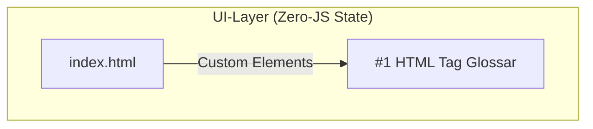

# 📝 GitHub Markdown Master-Referenz (v4.8)

Diese Referenz dient als Single Source of Truth für alle Formatierungen in Issues, Pull Requests und Diskussionen im DIN-BriefNEO Projekt.

---

## 🛠️ GitHub Formatting Toolbar: Funktionen & Syntax

### Grundlegende Formatierung

| Icon / Name | Markdown Syntax | Beschreibung & Best Practice |
|:---|:---|:---|
| **Heading** | `# H1`, `## H2`, `### H3` | `##` für Sektionen, `###` für Unterpunkte. H1 ist für den Titel reserviert. |
| **Bold** | `**Text**` | Hebt Key-Termine, Fehlermeldungen oder Dateinamen hervor. |
| **Italic** | `*Text*` | Für Fachbegriffe oder Hervorhebungen im Fließtext. |
| **Strikethrough** | `~~Text~~` | Markiert erledigte Tasks oder veraltete Informationen. |
| **Inline Code** | `` `code` `` | Für kurze Snippets, Dateinamen oder CLI-Kommandos. |
| **Code Block** | ` ```language` ... ` ``` ` | Mehrzeiliger Code mit Syntax-Highlighting (z.B. `javascript`, `css`, `powershell`). |
| **Quote** | `> Zitat` | Verweise auf Kommentare oder Spezifikationen. |
| **Link** | `[Text](URL)` | Verlinkung externer Quellen oder interner Dokumente. |

---

### Fortgeschrittene Elemente

| Element | Syntax | Anwendungsfall |
|:---|:---|:---|
| **Task List** | `- [ ]` oder `- [x]` | Fortschrittsbalken im Issue-Überblick (z.B. "2 von 5 Tasks"). |
| **Details** | `<details><summary>Titel</summary>...</details>` | Versteckt lange Logs, Konfigurationen oder Detailanalysen. |
| **Table** | Standard Markdown | Strukturierte Daten, Vergleiche oder Checklisten-Übersichten. |
| **Footnote** | `[^1]` ... `[^1]: Text` | Referenzen oder Quellenangaben am Dokumentende. |
| **Mermaid** | ` ```mermaid` ... ` ``` ` | Architektur-Diagramme, Flows und Sequenzen (siehe unten). |
| **Alerts** | `> [!NOTE]` ... `> [!TIP]` | Moderne Callouts für Hinweise, Warnungen und Tipps. |

---

## 🔗 Autolinks & Referenzen (Power-Features)

| Syntax | Funktion | Beispiel / Auswirkung |
|:---|:---|:---|
| `#42` | Link zu Issue/PR #42 | `Closes #42` schließt das Issue automatisch beim Merge. |
| ` @username` | Erwähnt einen Nutzer | Benachrichtigt `@grapefruit89`. |
| `:emoji:` | Emojis | `:rocket:` → 🚀, `:bug:` → 🐛, `:sparkles:` → ✨ |
| `[URL]` | Automatischer Link | Direkte URLs werden von GitHub automatisch klickbar gemacht. |

---

## 🎯 Slash-Commands (`/`)

Tippe `/` in ein leeres Textfeld, um das Schnellmenü zu öffnen:
- `/code-block`: Gerüst für Code mit Sprachauswahl.
- `/details`: Erzeugt ein ausklappbares Element.
- `/table`: Fügt eine Standard-Tabelle ein.
- `/tasklist`: Erstellt eine Checkliste.

---

## 🚀 Tastatur-Shortcuts (für Power-User)

| Shortcut | Funktion |
|:---|:---|
| `Strg + B` | Fett markieren |
| `Strg + K` | Link einfügen |
| `Strg + Shift + P` | Wechsel zwischen **Write** und **Preview** |
| `Strg + Enter` | Issue oder Kommentar absenden |
| `r` (beim Markieren) | Zitiert den markierten Text direkt in einem neuen Kommentar |

---

## 🎨 Mermaid-Diagramm – Best Practice

**Wichtig:** Verwende für Subgraphs immer Anführungszeichen um die Labels, um Parse-Fehler zu vermeiden.



---

## 🧩 Standard Issue-Vorlage

```markdown
## 🚨 Problem / Feature
[Kurze Beschreibung]

## 🔍 Steps to Reproduce
1. Schritt 1...
2. Schritt 2...

## ✅ Erwartetes Verhalten
[Was sollte passieren?]

## 📸 Screenshots / Logs
[Per Drag & Drop einfügen]

## 🏷️ Labels
- `bug` / `enhancement` / `documentation`
```

---

**Gesamtversion:** 4.8 | **Status:** ✅ Stabil | **Letzte Sync:** 2026-04-01